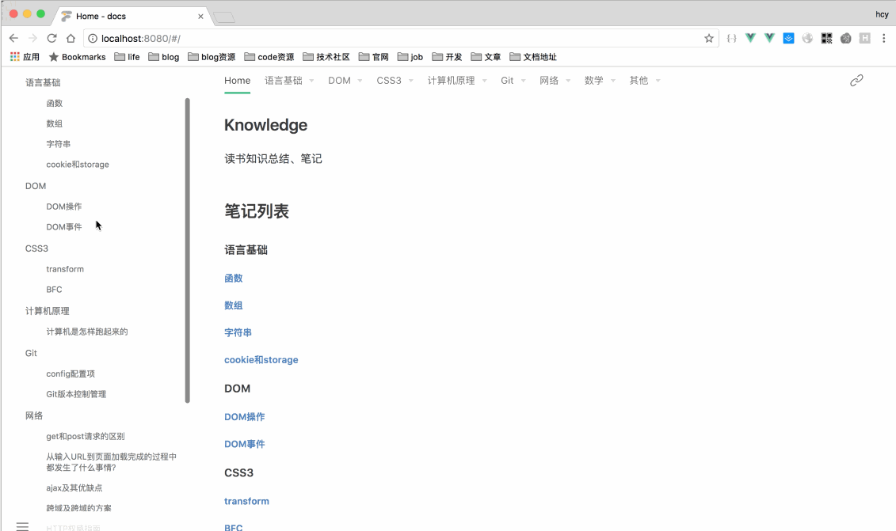

## knowledge

前端(Not just)工程师终究要掌握的知识

访问：[https://kb.hcysun.me](https://kb.hcysun.me)

## Intro
> 该项目收藏积累了前端(Not just)所应该掌握的知识，包括 JavaScript语言基础、DOM、CSS3、计算机原理、网络、性能、规范以及数学。

动图展示部分内容，该文档持续更新。



## Contribution

clone 项目：

```
git clone https://github.com/HcySunYang/knowledge.git
```

启动web服务：

```
// 你可以使用任何方式，如
http-server -p 9090
```

访问文档：

```
http://localhost:9090/docs
```

## Thanks

本文档使用开源文档工具 [docute](https://github.com/egoist/docute)