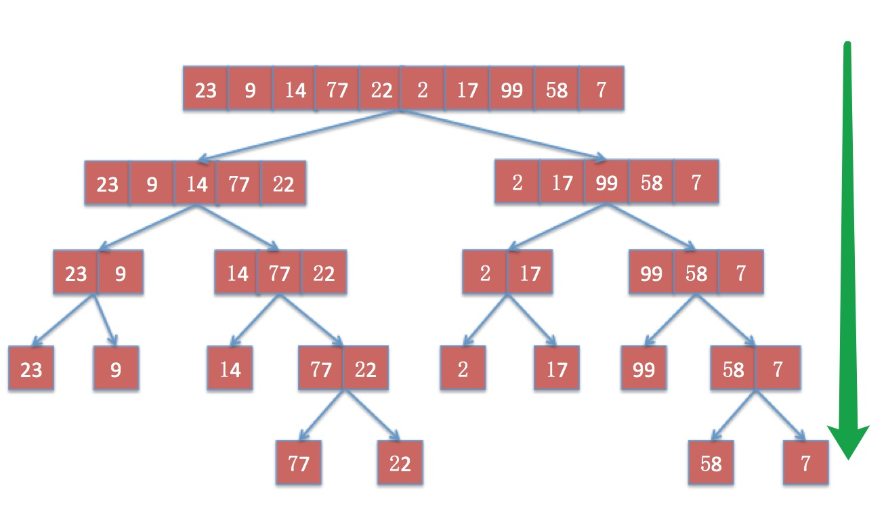

## 高级排序算法

高级排序算法常用来处理大型的数据集合，这个数据集可达上百万个元素，而不是几百几千个。通过你需要排序的数据集合规模较小，建议使用基本排序算法处理，因为在小规模数据下使用高级排序算法，并不能起到优化的作用，有的时候甚至会由于算法本身的实现方式而拖慢速度，比如小规模数据使用快速排序算法性能反而不好。

#### 希尔排序

##### 算法简介

希尔排序名字的来自于它的发明者：Donald Shell。希尔排序是对插入排序的改编版本，它和插入排序的不同在于，希尔排序会先比较离得较近的元素，而非相邻的元素，这在处理大规模数据的时候，能够使得元素更快的回到它应该出现的位置。

<p class="tip">算法的平均时间复杂度为 O(nlog n)</p>

##### 算法描述

希尔排序的关键在于 `间隔序列`，这个间隔序列可以是事先指定好的，也可以是动态生成的。间隔序列的特点为，每个间隔序列的值依次递减且最后一个值必须为1，假设间隔序列为：`[g1, g2, g3, g4, ...., gk]`，那么有

```js
g1 > g2 > g3 > g4 > ... > gk
```

且

```js
gk === 1
```

也可以动态生成间隔序列，动态生成间隔序列的算法是在《算法(第4版)》的合著者 `Robert Sedgewick` 提出的：

```js
// 计算后得到的 h 为间隔序列的最大值
let len = arr.length
let h = 1
while (h < len / 3) {
    h = h * 3 + 1
}

// 然后每趟间隔序列排序完成后，将 h 的值递减，直到 h 等于 1 为止，根据上面的生成算法，递减算法为：
h = (h - 1) / 3
```

有了间隔序列之后，对数组依次使用间隔序列的值进行排序，而非像插入排序那样每次都从有序序列的后面逐个向前扫描，这样做的好处是可以使元素更快的出现在它应该在的“范围之内”，这个范围会随着间隔序列的值逐渐减小，直到当间隔序列值为 1 的时候，便会逐个比较，不过此时由于元素已经出现在离正确位置很近的位置，所以排序进行的会很快。

##### 代码实现

```js
function shellSort (arr) {
    var len = arr.length
    var g = 1
    // 动态计算间隔序列
    while (g < len / 3) {
        g = g * 3 + 1
    }
    // 最后一趟比较的间隔应该为 1
    while (g >= 1) {
        // 开始一趟以 g 为间隔的比较，初始化 i = g，且 i 逐渐累加到数组的最后一个元素
        for (var i = g; i < len; i++) {
            // j 的初始化值为 i，j每次循环都会减少g，意味着：从第 i 个元素开始向前与相隔g个单位的元素进行比较。
            for (var j = i; j >= g && arr[j - g] > arr[j]; j -= g) {
                var temp = arr[j - g]
                arr[j - g] = arr[j]
                arr[j] = temp
            }
        }
        // 更新间隔值
        g = (g - 1) / 3
    }
}
```

#### 归并排序

##### 算法简介

归并排序的实现方式有两种，一种是自顶向下，另一种是子底向上。

归并排序是分治法的典型应用，他的名字来自与其排序的方式。

<p class="tip">算法的平均时间复杂度为 O(nlog n)，空间复杂度为 O(n)</p>

##### 算法描述

###### 自顶向下

首先将长度为 `n` 的数组分成两个长度为 `n/2` 的子数组，然后将两个子数组递归的执行一分为二的操作，直到每个子数组中至多包含一个元素为止。由于这是一个递归的过程，当程序回溯的时候，将两个子数组进行排序合并，直到回溯完毕，此时排序完成，如下图：



上图描述了一个数组被递归拆分的过程，除此之外，在程序回溯的时候，一次保证数组有序，如下图：


###### 自顶向下的代码实现

代码来自：[https://github.com/damonare/Sorts](https://github.com/damonare/Sorts)，并做了适当的修改和注释：

```js
// 调用的主要方法
function mergeSort (arr) {
    let len = arr.length
    // 递归结束的条件
    if(len < 2) {
        return arr
    }
    // 对数组进行拆分，拆为 left 和 right
    let middle = Math.floor(len / 2),
        left = arr.slice(0, middle),
        right = arr.slice(middle)
    // 递归调用，采用尾递归优化
    return merge(mergeSort(left), mergeSort(right))
}

// merge方法用来对两个数组进行排序，并返回排好序的数组
function merge (left, right) {
    var result = []
    // 对两个子数组进行排序
    while (left.length && right.length) {
        if (left[0] <= right[0]) {
            result.push(left.shift())
        } else {
            result.push(right.shift())
        }
    }

    // 由于两个子数组的元素个数不一定相等，所以在上一个while循环排序完成后，
    // 要检查left和right中是否还有元素，如果有则推入结果数组中
    while (left.length) {
        result.push(left.shift())
    }
    while (right.length) {
        result.push(right.shift())
    }

    return result
}
```
