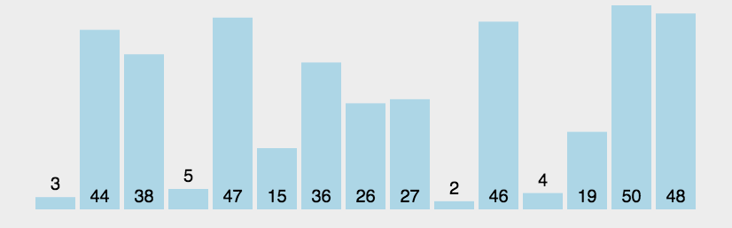
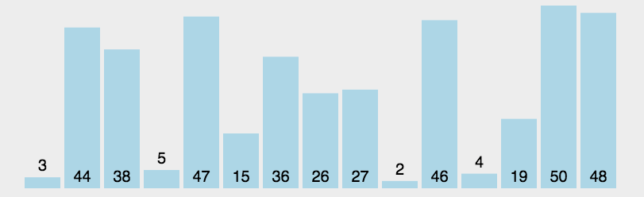
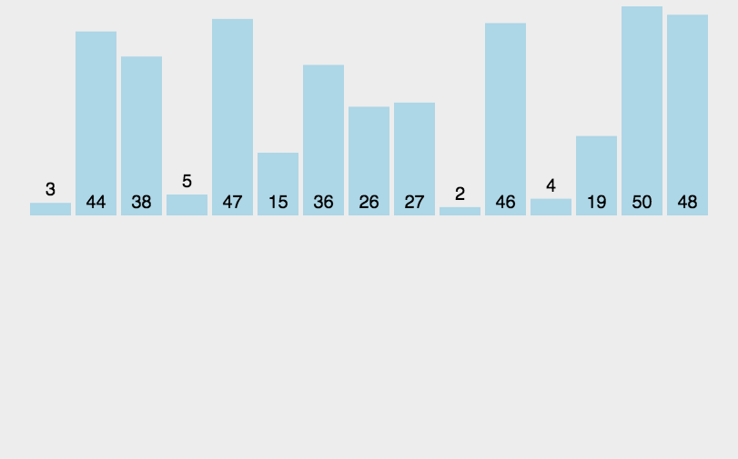

## 基本排序算法
#### 冒泡排序

##### 算法简介

冒泡排序属于基本排序算法之一，基本排序算法的一个特点是：需要两层嵌套的循环。外层循环用于遍历数组的每一项，内层循环用于对元素进行比较。

<p class="tip">算法的时间复杂度为 O(n²)</p>

##### 算法描述

冒泡这个名字来自于该算法的排序过程，即数据会像气泡一样从数组的一端浮动到另外一端。

以升序为例，算法的过程为：
* 1、使用数组的第一个元素和数组的第二个元素作比较，如果第一个元素大于第二个元素，就叫唤它们的位置。
* 2、再使用数组的第二个元素和数组的第三个元素作比较，比较方式同步骤一
* 3、如步骤一和步骤二的方式，当第一轮比较结束之后，能够保证数组最右端的项为最大值
* 4、进入下一轮比较，此时由于已知数组的最后一项为最大值，所以比较的次数可以减少一次
* 5、重复步骤4直到排序完成

一图胜千言（图片来自：[https://github.com/damonare/Sorts](https://github.com/damonare/Sorts))：



##### 代码实现

```js
function bubbleSort (arr) {
    var num = arr.length
    for (var i = 0; i < num - 1; i++) {
        // 这里的 num - 1 - i 中的 i 很关键，保证了每轮的比较次数减一
        for (var j = 0; j < num - 1 - i; j++) {
            if (arr[j] > arr[j + 1]) {
                // 交换元素
                var temp = arr[j]
                arr[j] = arr[j + 1]
                arr[j + 1] = temp
            }
        }
    }
}
```

##### 优化冒泡排序

假设我们有如下数组：

```js
var arr = [2, 1, 3, 4, 5, 6, 7, 8, 9]
```

对于该数组的排序，其实我们只需要将数组的第一个元素 `2` 与数组的第二个元素 `1` 交换一下位置即可，因为后边的数据已经是有序的了。

但是我们上面的冒泡排序算法，在对该数组进行排序时第一轮排序依然会对比到数组的最后一个元素，第二个排序会对比到数组的倒数第二个元素。这个时候，我们是有一些优化手段的，其中一个解决办法就是设置一个标志，该标志存储了最后一次数据位置交换的索引。大家可以想象一下 `最后一次位置交换` 以为着什么？它意味着该位置后边的元素已经是有序的了。所以下一轮比较只需要比较到该位置即可。

优化后的代码如下：

```js
function bubbleKeySort (arr) {
    // pos为最后一次交换数据位置的标志，初始化为数组最后一个元素
    var pos = arr.length - 1
    // 只要 pos 大于0，就开启新一轮的比较
    while (pos > 0) {
        // 变量 p 用来存储本轮比较最后一次交换数据的位置，初始化为 0，这个很关键，因为当本轮比较结束之后如果 p 仍然为 0，那么就不会再执行 while 循环，此时数据已经排好序
        var p = 0
        for (var j = 0; j < pos; j++) {
            if (arr[j] > arr[j + 1]) {
                // 更新 p 的值
                p = j
                var temp = arr[j]
                arr[j] = arr[j + 1]
                arr[j + 1] = temp
            }
        }
        // 本轮比较结束之后，更新 pos 的值
        pos = p
    }
}
```

#### 选择排序

##### 算法简介

选择排序和冒泡排序一样，同属于基本排序算法。

<p class="tip">算法的时间复杂度为 O(n²)</p>

##### 算法描述

选择排序的关键在于 `选择` 二字，拿数组的第一个元素和数组其他元素作比较，然后找到数组中最小(大)的元素，将最小的元素 `选择` 出来，放到数组的第一个位置，然后再拿数组的第二个元素和其他元素其他元素作比较，重复之前的比较步骤。这样由于每次都选择最小(大)的元素，将这些元素一次摆放就可以将数组排好序。

一图胜千言（图片来自：[https://github.com/damonare/Sorts](https://github.com/damonare/Sorts))：



##### 代码实现

以升序为例：

```js
function selectionSort (arr) {
    // 从数组的 第一个 元素遍历到数组的 倒数第二个 元素
    for (var i = 0; i < arr.length - 1; i++) {
        // min为最小值的索引，被初始化为i，即假设每轮比较的首个元素就是最小的
        var min = i
        // 从数组的 i + 1 个元素遍历到数组的 最后一个 元素
        for (var j = i + 1; j < arr.length; j++) {
            // 与预期的最小值进行比较，如果比预期的最小值还小，就更新最小值
            if (arr[j] < arr[min]) {
                min = j
            }
        }
        // 第二层循环结束时，min索引指向的元素即为最小的元素，交换位置开始下一轮比较
        var temp = arr[i]
        arr[i] = arr[min]
        arr[min] = temp
    }
}
```

#### 插入排序

##### 算法简介

插入排序也属于基本排序算法。

<p class="tip">算法的时间复杂度为 O(n²)</p>

##### 算法描述

插入排序的思路是构建有序序列，取出数组的第一个元素，认为其实有序的，然后再取出数组的第二个元素与有序序列中的元素进行比较，然后插入合适的位置，知道数组中的所有元素都被 `取出-比较-插入-完成`。

一图胜千言（图片来自：[https://github.com/damonare/Sorts](https://github.com/damonare/Sorts))：



##### 代码实现

以升序为例：

```js
function insertionSort (arr) {
    // 从数组第二项开始遍历，即默认第一项为有序的
    for (var i = 1; i < arr.length; i++) {
        // j代表数有序序列的最后一项
        var j = i - 1
        var temp = arr[i]
        // 从有序序列最后一项向前扫描，与 temp 对比，如果比temp大，则后移一位
        while (j >= 0 && arr[j] > temp) {
            arr[j + 1] = arr[j]
            j--
        }
        // 退出循环后，arr[j]的元素是小于等于temp的，所以将temp插入到 j+1 的位置
        arr[j + 1] = temp
    }
}
```