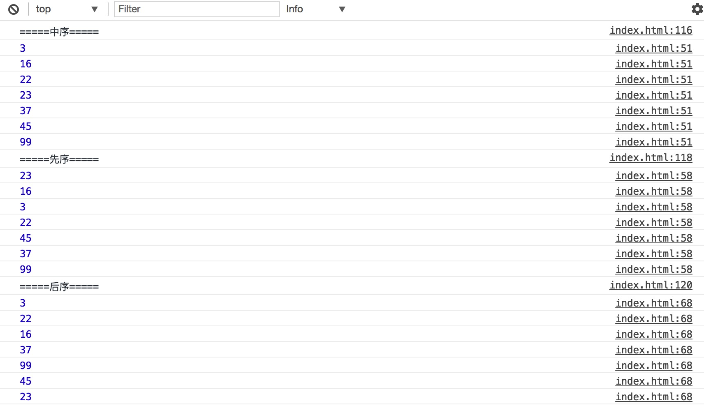

## 二叉树和二叉查找树

#### 树

##### 简介

树是计算机科学中经常用到的一种数据结构，以分层的方式存储数据，所以经常用来存储具有层级关系的数据，比如文件系统。

此外，树也被用来存储有序的列表，例如二叉查找树，在二叉查找树上进行查找非常快。

##### 树的相关概念

如下图，展示了有关树的术语：


上图描述了一个树，图中的每一个圆圈都是一个 `节点`，连接节点的线叫做 `边`。一棵树最上面的节点称为 `根节点`，如果一个节点下面连接多个节点，那么称该节点为 `父节点`，下面的节点为 `子节点`，没有子节点的节点称为 `叶子节点`。

从一个节点到与它不直接相连的节点的这一组边称为 `路径`，如图中(23-17-19)。

树可以分为几个层次，根节点是第0层，根节点的子节点是第1层，子节点的子节点是第2层，以此类推。层的数量代表了树的 `深度`。

任何一层的节点，都可以看做是子树的根。

#### 二叉树和二叉查找树

##### 概念

子节点的数量不超过2个的树称为 `二叉树`。

##### 简介

二叉树是一种特殊的树，二叉树中的任何一个节点的子节点的数量最多为2个，我们分别称这两个节点为 `左节点` 和 `右节点`。

通过把节点的数量限定为2，可以写出高效的程序在树种插入，查找，删除。

##### 二叉查找树

二叉查找树是一种特殊的二叉树。相对较小的值存储在左节点中，较大的值存储在右节点中，这一特性使得查找效率非常高。

#### 实现二叉查找树

##### 插入节点

树是由节点组成的，所以我们需要一个节点类（Node）：

```js
function Node (data) {
    this.data = data
    this.left = null
    this.right = null
}
```

每个节点除了保存自身的数据之外，还保存着对子节点的引用(left/right)。

之后我们就可以构建二叉查找树了，假设我们的二叉查找树类是 `Bst`：

```js
function Bst () {
    this.root = null
}
// 插入节点
BST.prototype.insert = function (data) {

}
```

`Bst` 类在初始状态保存着整个二叉查找树的根节点(root)，`Bst` 拥有一个用来插入节点的方法：`insert`，接收节点的数据，并插入相应的位置，根据二叉查找树的特性：较小的值存放在左节点中，较大的值存放在右节点中，所以 `insert` 算法如下：

* 1、根据输入的数据 `data` 创建一个新的节点。
* 2、检查是否有根节点，如果没有根节点证明这是一颗新树，将该节点作为跟节点。
* 3、否则，开始遍历树，将根节点设为当前节点，使用新节点与当前节点作比较，如果新节点的值小于当前节点。
    * 3.1、如果当前节点的左子节点为null，则将新节点设为当前节点的左子节点，退出循环。
    * 3.2、如果当前节点的左子节点不为null，则更新当前节点为当前节点的左子节点，执行下一次循环。
* 4、如果新节点的值大于当前节点。
    * 4.1、如果当前节点的右子节点为null，则将新节点设为当前节点的右子节点，退出循环。
    * 4.2、如果当前节点的右子节点不为null，则更新当前节点为当前节点的右子节点，执行下一次循环。

根据上面的算法，我们可以写出如下代码：

```js
BST.prototype.insert = function (data) {
    var n = new Node(data)
    if (!this.root) {
        this.root = n
        return
    }
    var current = this.root
    while (true) {
        if (data < current.data) {
            if (!current.left) {
                current.left = n
                break
            }
            current = current.left
        } else {
            if (!current.right) {
                current.right = n
                break
            }
            current = current.right
        }
    }
}
```

##### 遍历树

由于二叉查找树的性质，较小的值存放在左边，较大的值存放在右边，所以通过对树的遍历，我们很容易实现按照特定的顺序显示数据，比如数字从小到大，字母的先后顺序等。

遍历二叉查找树的方式有三种：中序、先序、后序，代码实现起来很简单，如下：

```js
// 中序
BST.prototype.inOrder = function (node) {
    if (node) {
        this.inOrder(node.left)
        console.log(node.data)
        this.inOrder(node.right)
    }
}
// 先序
BST.prototype.preOrder = function (node) {
    if (node) {
        console.log(node.data)
        this.preOrder(node.left)
        this.preOrder(node.right)
    }
}
// 后序
BST.prototype.postOrder = function (node) {
    if (node) {
        this.postOrder(node.left)
        this.postOrder(node.right)
        console.log(node.data)
    }
}
```

我们使用如下代码来测试以上遍历的实现：

```js
var tree = new Bst()
tree.insert(23)
tree.insert(45)
tree.insert(16)
tree.insert(37)
tree.insert(3)
tree.insert(99)
tree.insert(22)

console.log('=====中序=====')
tree.inOrder(tree.root)
console.log('=====先序=====')
tree.preOrder(tree.root)
console.log('=====后序=====')
tree.postOrder(tree.root)
```

可以在控制台看到中序、先序、后序的遍历顺序分别为：



##### 查找

二叉查找树的查找分为：
* 查找最小值
* 查找最大值
* 查找给定值

###### 查找最小值

我们知道，二叉查找树的特性就是较小的值存储在左边，所以要找到最小的值，只需要遍历左子树到最后一个节点即可，该节点即保存着最小值：

```js
BST.prototype.getMin = function () {
    var current = this.root
    while (current.left) {
        current = current.left
    }
    return current.data
}
```

###### 查找最大值

类似于查找最小值，只不过遍历的是右子树：

```js
BST.prototype.getMax = function () {
    var current = this.root
    while (current.right) {
        current = current.right
    }
    return current.data
}
```

###### 查找给定值

查找给定值稍微复杂一点，算法如下：

* 1、设当前节点为根节点，对树进行遍历
* 2、比较要查找的值是否等于当前节点的值，如果是则返回当前节点
* 3、如果要查找的值小于当前节点的值，则更新当前节点为当前节点的左节点，执行第 2 步
* 4、如果要查找的值大于当前节点的值，则更新当前节点为当前节点的右节点，执行第 2 步
* 5、未找到返回 null

代码如下：

```js
BST.prototype.find = function (data) {
    var current = this.root
    while (current) {
        if (current.data === data) {
            return current
        }
        if (data < current.data) {
            current = current.left
        }
        if (data > current.data) {
            current = current.right
        }
    }
    return null
}
```
