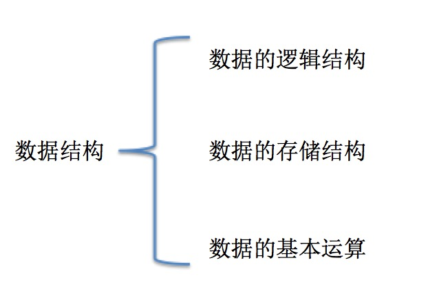
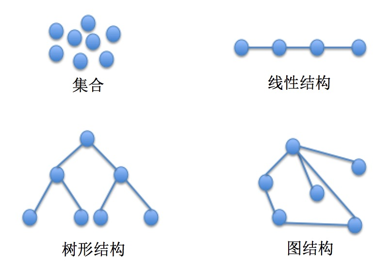

## 数据结构以及相关术语的概念

#### 数据

###### 数据

数据：所有被计算机存储、处理的对象都叫做数据。如：文字、语音、图像、视频 等等，数据的含义非常广泛。

###### 数据元素

`数据` 是由 `数据元素` 组成的，`数据元素` 是数据的基本单位。

###### 数据项

`数据元素` 是数据的基本单位，而数据项是数据的不可分割的最小标示单位，`数据元素` 由若干个 `数据项组成`

#### 数据结构

数据结构描述了一个 `数据` 中 `数据元素` 间的某种关系。它包括：`数据的逻辑结构`、`数据的存储结构`、`数据的基本运算`。

###### 数据的逻辑结构

数据的逻辑结构描述的是 `数据元素` 间的逻辑关系，比如一个数据中数据元素间可能没有任何关系，那么这种数据的数据逻辑结构叫 `集合`，如果数据元素间是一个接着一个排列的，那么这种数据的数据逻辑结构叫 `线性结构`，常见的数据逻辑结构有四大类：

* 集合
* 线性结构
* 树形结构
* 图结构

如下图所示：

###### 数据的存储结构

数据的逻辑结构在计算机中实现称为 `数据的存储结构`。

数据的存储结构由 `数据元素` 与 `元素间的关系` 组成，表示元素间的关系主要有两种方式：`顺序存储` 和 `链式存储`，如下图：

* 顺序存储：存储节点存放在一个连续的存储区域里。
* 链式存储：存储节点除了包含数据元素外，还包含一个指向其他存储节点的指针。

###### 数据的基本运算

数据的基本运算指的是：对数据的逻辑结构施加一系列操作。

比如栈有如下基本操作：

* push(element)【压入栈】
* pop()【弹出栈】
* peek()【预览栈顶】
* clear()【清空栈】
* length()【获取栈的元素个数】

队列有如下基本操作：

* enqueue(element)【入队】
* dequeue()【出队】
* peek()【读取队头的元素】
* clear()【清空队列】
* length()【获取队列的元素个数】

类似于着一些列的操作，我们成为数据的基本运算。

我们知道，栈和队列拥有相同的逻辑结构，即都是线性结构，但他们并不是相同的数据结构，因为他们拥有不同的基本运算。不要忘了数据结构所代表的是数据的逻辑结构、数据的存储结构以及数据的基本操作三者共同的作用：

