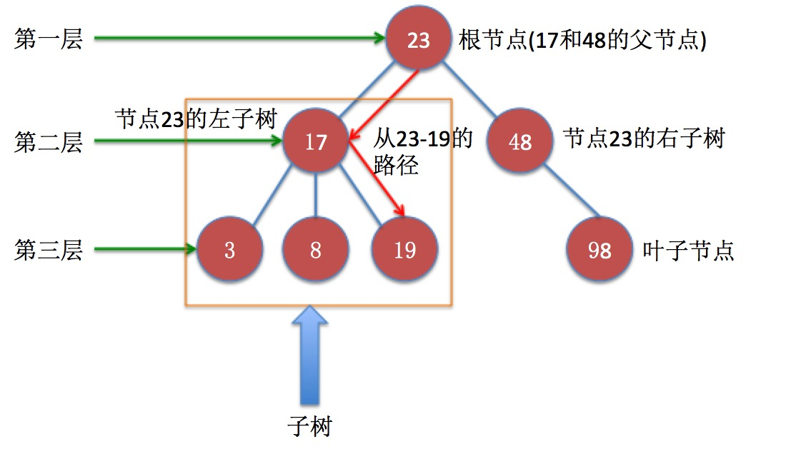
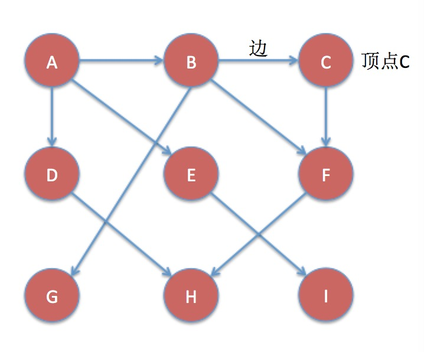
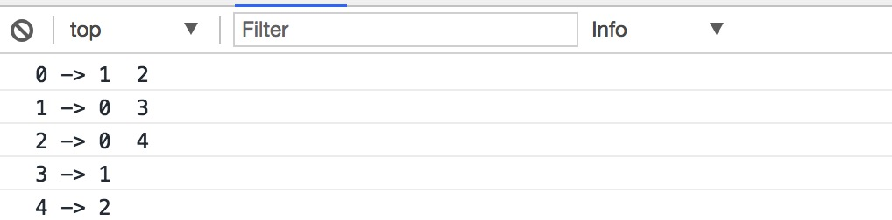
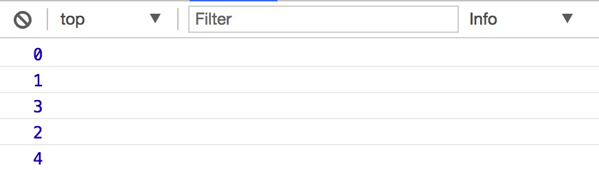
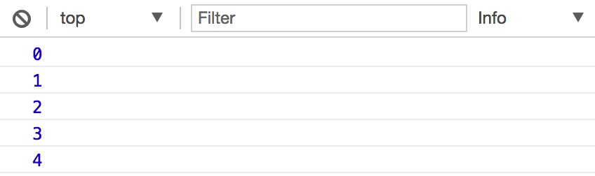

## 图

#### 图的现实意义

可以用图对现实中很多系统进行建模，比如：交通流量模型，航空公司的飞行系统，局域网或广域网等计算机网络，可以说图的应用场景非常多。

#### 一些概念

##### 图、边、顶点

图由 `边的集合` 和 `顶点的集合` 组成。我们可以拿来一张中国地图，每一个省份可以看做是一个 `顶点`，临接的省份之间可以画一条线，这条线就是 `边`。

##### 顶点对

`边` 是由 `顶点对` 定义的，比如边 `l` 是由顶点对 `(p1, p2)` 定义的。

##### 有向图、顶点的流向

`顶点` 是有 `权重` 的，或者叫做 `成本`，可以根据 `权重` 对 `顶点对` 进行排序，如果一个图的 `顶点对` 是有序的，我们称之为 `有向图`。

`有向图` 表明了 `顶点的流向`

##### 无向图

如果图是无序的，我们称之为 `无序图`

##### 路径、路径的长度

从一个顶点到达另外一个顶点所经过的边组成 `路径`。

`路径的长度` 是由边的数量定义的。

##### 环

指向自身的顶点构成的路径成为 `环`，`环` 的长度为 `0`。

##### 圈、简单圈、平凡圈

`圈` 是 `长度 >= 1` 的路径，且路径的第一个顶点和最后一个顶点相同。

除了第一个和最后一个顶点之外，没有重复的顶点或重复边的圈成为 `简单圈`，否则成为 `平凡圈`。

##### 顶点强连通、有向图强连通

如果两个顶点之间有 `路径`，那么 `这两个点就是强连通` 的。

如果 `有向图` 的所有顶点都是强连通的，那么这个 `有向图也是强连通` 的。

#### 分析

##### 如何存储(表示)图？

我们不妨先来看一下 `图` 和 `二叉树` 的图片示意：

###### 树的示意图



###### 图的示意图 



我们之前讲过树的存储结构是，需要节点类表示树中的节点，每个节点除了保存自身数据外，还有用对子节点的引用，从而构造一颗树。

根据上面树和图的示意图，可能很多同学觉得他们很像，你可能尝试用构建树的方法去构建图，即在节点中保存相连接节点的引用，但实际上这种方法是有问题的，原因是：树是有清晰的层次结构的，而图的层次结构是很复杂的。

所以我们需要思考：如何存储图？

###### 邻接表

一种用来存储图的方式是使用邻接表数组，首先我们需要用一个数组来存储图中所有的顶点，假设我们如下5个顶点：

```
A B C D E
```

我们使用一个数组来存储这5个顶点，称之为顶点数组：

```js
let vertex = ['A', 'B', 'C', 'D', 'E']
```

顶点 `A` 在数组中的位置是 `0`，`B` 在数组中的位置是 `1`，以此类推。

接下来，我们同样还需要一个数组，即我们的邻接表数组，该数组存储为由一个顶点相邻的顶点组成的数组，并以顶点在顶点数组中的位置作为索引，这样我们根据顶点在顶点数组中的索引，访问邻接表数组，就可以迅速的知道有哪些顶点与其相连：

```js
let vertex = ['A', 'B', 'C', 'D', 'E']
let adj = [
    ['B', 'D'],
    ['A'],
    ['D', 'E'],
    ['A', 'C'],
    ['C']
]
```

如上面的代码顶点 `A` 在 `vertex` 中的索引为 `0`，我们通过访问 `adj[0]` 可以得到数组 `['B', 'D']`，说明顶点 `A` 与顶点 `B` 和 `D` 相连。

###### 代码实现

实现图的过程，实际上就是构造顶点数组 `vertex` 以及 邻接表数组 `adj` 的过程。

首先顶点可能由很多复杂的数据构成，比如地图中的城市拥有名称、经纬度等等，所以我们需要一个顶点类，类似于二叉树中的节点类，如下：

```js
// 顶点类
function Vert (data, visited) {
    // 顶点的数据
    this.data = data
    // 标示着顶点是否被访问过
    this.visited = visited
}
```

有了顶点类，我们就可以构造顶点数组了，为了方便，我们顶点中只保存整型数据：

```js
let vertex = [
    new Vert(0),
    new Vert(1),
    new Vert(2),
    new Vert(3),
    new Vert(4)
]
```

下一步就是构造邻接表数组，这个邻接表数组实际上就是图的描述，我们需要一个 `Graph` 类：

```js
// 图类，构造邻接表数组 adj，传递顶点数组 vertex 进行初始化
function Graph (vertex) {
    this.vertex = vertex
    // 顶点数量
    this.quantity = vertex.length
    // 边的数量
    this.edges = 0
    // 邻接表数组
    this.adj = []
    for (let i = 0; i < this.quantity; i++) {
        this.adj[i] = []
    }
}
```

如上代码，`Graph` 类通过传递给它的顶点数组构造一个图，在初始状态，图中的顶点之间没有任何关系，所以边的数量为 0，邻接表数组被初始化为与顶点相对应的空数组。

接下来，我们的 `Graph` 类需要一个方法 `addEdge`：

```js
Graph.prototype.addEdge = function (v1, v2) {

}
```

`addEdge` 方法接收两个顶点数据作为参数，并根据数据确定对应顶点，然后将数据值为 `data2` 的顶点 `v2` 添加到数据值为 `data1` 的顶点 `v1` 对应的邻接表数组中，即 `v2` 与 `v1` 相连，实现如下：

```js
Graph.prototype.addEdge = function (data1, data2) {
    // 查找顶点 v1 在顶点数组的位置
    var v1Index = this.searchPos(data1)
    // 查找顶点 v2 在顶点数组的位置
    var v2Index = this.searchPos(data2)
    
    this.adj[v1Index].push(v2Index)
    this.adj[v2Index].push(v1Index)
    this.edges++
}
```

上面的代码中我们使用了 `searchPos` 方法，该方法查找拥有指定数据的顶点在顶点数组中的位置，实现如下：

```js
Graph.prototype.searchPos = function (data) {
    var index = -1
    for (var i = 0; i < this.quantity; i++) {
        if (this.vertex[i].data == data) {
            index = i
            break
        }
    }
    return index
}
```

为了方便查看，我们需要一个 `showGraph` 方法，用来查看图：

```js
Graph.prototype.showGraph = function () {
    var putStr = ''
    for (var i = 0; i < this.quantity; i++) {
        putStr = ''
        putStr += i + ' -> '
        for (var j = 0; j < this.quantity; j++) {
            if (this.adj[i][j] !== undefined) {
                putStr += ' ' + this.adj[i][j] + ' '
            }
        }
        console.log(putStr)
    }
}
```

`showGraph` 方法只是简单的对邻接表数组进行遍历输出。

现在，我们可以写一些测试代码：

```js
// 顶点数组
var vertex = [
    new Vert(0),
    new Vert(1),
    new Vert(2),
    new Vert(3),
    new Vert(4)
]

var g = new Graph(vertex)
g.addEdge(0, 1)
g.addEdge(0, 2)
g.addEdge(1, 3)
g.addEdge(2, 4)

g.showGraph()
```

打开浏览器控制台，应该看到如下输出：



##### 图的搜索

经常用图来解决的问题比如：从一个城市到另外一个城市的最短距离，这个问题实际上可以抽象出从图中的一个顶点到达另外一个顶点的最短路径的问题。图的这一操作叫做搜索，对图有两种基本搜索方式：`深度优先搜索`、`广度优先搜索`。

###### 深度优先搜索

深度优先搜索的思路是，从一条路径的顶点开始，直到到达最后一个顶点，然后回溯，继续追溯下一条路径。

具体到我们的存储结构：`顶点数组` 和 `邻接表数组`，我们找到起始顶点在 `顶点数组` 中的位置，然后找到相应位置 `邻接表数组` 中存储的相邻顶点，做递归搜索即可，代码如下：

```js
Graph.prototype.dfs = function (data) {
    // 找到起始顶点在邻接表数组中的位置
    var index = this.searchPos(data)
    // 将其设置为已访问
    this.vertex[index].visited = true
    console.log(this.vertex[index].data)

    // 遍历邻接表数组中存储的相邻顶点，递归搜索
    for (var i = 0; i < this.adj[index].length; i++) {
        var key = this.adj[index][i]
        if (!this.vertex[key].visited) {
            this.dfs(this.vertex[key].data)
        }
    }
}
```

针对上面的例子写如下测试代码：

```js
g.dfs(0)
```

输出如下：



###### 广度优先搜索

深度优先搜索是纵向延伸的搜索，而广度优先搜索是横向延伸的搜索。递归可以解决深度优先所搜，而广度优先搜索需要使用一个队列，来操作，具体代码并不复杂，如下：

```js
Graph.prototype.bfs = function (data) {
    // 一个队列
    var queue = []
    // 找到起始顶点在邻接表数组中的位置
    var index = this.searchPos(data)
    // 将起始顶点入队
    queue.push(index)

    // 遍历队列的过程就是在横向搜索
    while (queue.length > 0) {
        var i = queue.shift()
        this.vertex[i].visited = true
        console.log(this.vertex[i].data)

        for (var j = 0; j < this.adj[i].length; j++) {
            if (!this.vertex[this.adj[i][j]].visited) {
                queue.push(this.adj[i][j])
            }
        }
    }
}
```

还是针对前面的例子，写如下测试代码：

```js
g.bfs(0)
```

输出如下：

