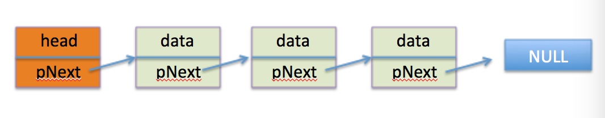
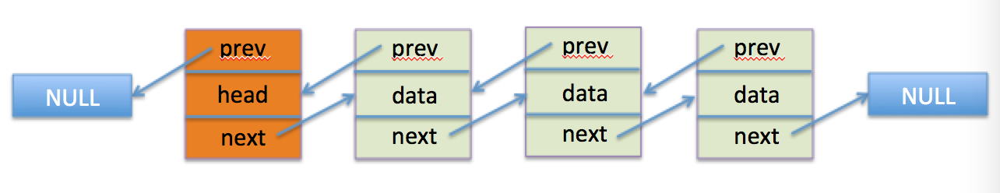
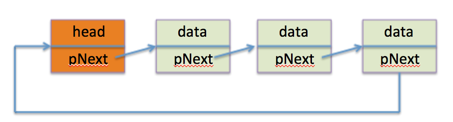
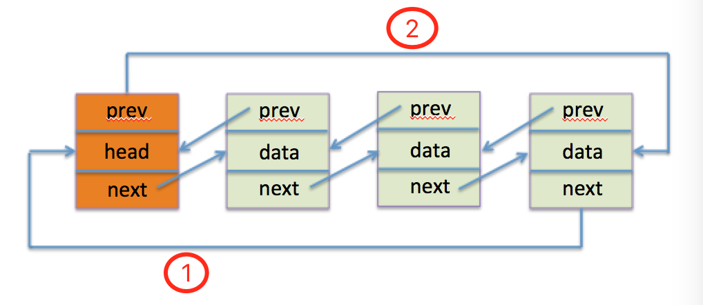

## 链表

#### 链表的优势

链表是一种特殊的列表，不同于数组，数组不总是组织数据的最佳数据结构，原因如下：

* 在有些变成语言中：
    * 数组的长度是需要预先设定好的，也就是说数组的长度是固定的，想要扩展会很困难。
    * 向数组中添加或删除元素也很麻烦，因为需要将数组的元素向前或向后循环位移。
* 在JavaScript中
    * JavaScript显然不存在上述两个数组缺点的说法，因为数组的长度是可变的，另外可以使用 `splice` 方法轻松的对数组进行添加删除的操作。
    * 但也正因如此，我们不要忘了，在JavaScript中，数组也是对象，js中的数组是作为对象被实现的，所以与其他语言(如：C++、java)相比，性能会差很多。

另外，数组中元素的存储地址是连续的，但是当我们的数据量很大时，可能会很难寻找到空间足够大又连续的内存空间，而链表的存储方式不要求地址连续。

但并不是说链表一定比数组好，数组的优势在于随机访问，比如我们访问数组的第20个元素，可以很快的访问到，然而链表就会比较困难，另外在链表中，我们也不会说第几元素，我们会用链表中节点之间的引用来描述元素间的关系。

#### 链表的概念

###### 节点（Node）

链表中的元素称为节点

###### 链

节点间的引用称为链

###### 节点的种类

* 单向链表
* 单向循环链表
* 双向链表
* 双向循环链表

#### JavaScript实现

###### 单向链表

通常情况下，我们会选择一个头结点(Head)作为链表的接入点，如果用一张图来表示单向链表，那么应该是这样的：



我们需要两个类，一个节点类（Node），另外一个是链表类（Llist），先创建 `Node` 类，如下：

```js
function Node (data) {
    this.data = data
    this.next = null
}
```

然后是链表类 `Llist`：

在创建 `Llist` 之前，我们要明确单向链表的属性和方法：

* 属性：
    * head (头节点的引用)
* 方法：
    * insertAfter

```js
function Llist () {
    // 头节点
    this.head = new Node('head')
}
Llist.prototype = {
    constructor: Llist,
    // 插入节点：将 newNode节点 插入到 node节点 之后
    insertAfter: function (newNode, data) {

    },
    // 删除节点
    remove: function (data) {

    },
    // 查找节点
    find: function (data) {

    },
    // 显示全部节点
    display: function () {

    }
}
```

首先，我们来看一下 `insertAfter` 方法，`insertAfter` 方法用来将新节点 `newNode` 插入到 `data` 属性为给定值的节点的后面。所以我们需要 `find` 方法，该方法用来寻找 `data` 属性值为给定值的节点，`find` 方法实现如下

```js
find: function (data) {
    var current = this.head
    while (current && current.data != data) {
        current = current.next
    }
    return current
}
```

有了 `find` 方法，我们就可以轻松实现 `insertAfter` 方法了：

```js
insertAfter: function (newNode, data) {
    var target = this.find(data)
    newNode.next = target.next
    target.next = newNode
}
```

`remove` 方法用来删除 `data` 属性值为给定值的节点，删除节点的思路是：找到要删除的节点的前一个节点，然后让该节点的 `next` 属性指向要删除的节点的 `next` 属性所指向的节点，为此，我们需要一个辅助方法 `findPrev` 用来寻找要删除节点的前一个节点：

```js
findPrev: function (data) {
    var current = this.head
    while (current && current.next && current.next.data != data) {
        current = current.next
    }
    return current
}
```

有了 `findPrev` 我们就可以实现 `remove` 方法了：

```js
remove: function (data) {
    var prev = this.findPrev(data)
    if (prev.next) {
        prev.next = prev.next.next
    }
}
```

最后，我们来写一个遍历所有节点的方法，用来显示节点数据：

```js
display: function () {
    var current = this.head
    while (current.next) {
        console.log(current.next.data)
        current = current.next
    }
}
```

接下来，我们就可以写一个测试脚本了：

```js
var list = new Llist()
var new1 = new Node('new1')
var new2 = new Node('new2')
var new3 = new Node('new3')
list.insertAfter(new1, 'head')
list.insertAfter(new2, 'new1')
list.insertAfter(new3, 'new1')
list.display()  // 输出：new1 new3 new2
list.remove('new3')
list.display()  // 输出：new1 new2
```

###### 双向链表

双向链表与单向链表相比，每一个节点多出一个属性 `prev`，该属性指向当前节点的前一个节点，头节点的 `prev` 属性指向 `Null`：



双向链表相比于单向链表，在删除节点的时候，效率会更高，还记我们在单向链表中删除节点时需要使用 `findPrev` 方法去查找目标节点的前一个节点吗？在双向链表中，我们仅仅通过目标节点的 `prev` 属性即可访问其前一个节点，而不需要遍历查找，效率自然会高，但在插入节点的时候我们需要做更多的事情，除了保证 `next` 属性指向正确之外，还要保证 `prev` 属性指向正确，下面是完整的双向链表实现：

```js
function Llist () {
    // 头节点
    this.head = new Node('head')
}
Llist.prototype = {
    constructor: Llist,
    // 插入节点：将 newNode节点 插入到 node节点 之后
    insertAfter: function (newNode, data) {
        var target = this.find(data)
        newNode.next = target.next
        if (target.next) {
            target.next.prev = newNode
        }
        target.next = newNode
        newNode.prev = target
    },
    // 删除节点
    remove: function (data) {
        var target = this.find(data)
        target.prev.next = target.next
        target.next.prev = target.prev
        target.next = target.prev = null
    },
    // 查找节点
    find: function (data) {
        var current = this.head
        while (current && current.data != data) {
            current = current.next
        }
        return current
    },
    // 显示全部节点
    display: function () {
        var current = this.head
        while (current.next) {
            console.log(current.next.data)
            current = current.next
        }
        console.log('======')
    }
}
```

###### 单向循环链表

我们仅仅需要添加一行代码，就可以把单向链表修改为单向循环链表。

还记的单向链表中的头节点的 `next` 属性最初指向的是什么吗？是 `Null`，当我们在头节点后面添加一个节点之后，头节点的 `next` 便指向了新添加的节点，而新添加的节点会指向 `Null`，也就是说，随着节点的添加，头节点最初的指向，总会传递给最后一个节点。既然如此，如果我们在初始化链表的时候，使头节点的 `next` 属性指向自身会怎么样？答案是：随着节点的添加，最后一个节点总会指向头节点。这样我们就得到了一个单向循环链表：

只需要在 `Llist` 类中添加一句：

```js
this.head.next = this.head
```

完整代码如下：

```js
function Llist () {
    this.head = new Node('head')
    this.head.next = this.head
}
```

最终效果如下图：



###### 双向循环链表

对于双向循环链表，我们同样可以通过对双向链表的修改得到，我们来看看双向链表的示意图：


对于双向循环链表，我们期望应该是这样的：



我们增加了两条线（图中的 线1 和 线2），对于第一条线，我们同样可以利用创造单向循环链表的方式来构建，即：

```js
function Llist () {
    this.head = new Node('head')
    this.head.next = this.head      // 这句话是重点
}
```

对于线2，我们可以在插入节点的方法 `insertAfter` 中做文章，如下：

```js
insertAfter: function (newNode, data) {
    var target = this.find(data)
    newNode.next = target.next
    if (target.next) {
        target.next.prev = newNode
    }
    target.next = newNode
    newNode.prev = target

    // 这里是新添加的内容
    if (newNode.next === this.head) {
        this.head.prev = newNode
    }
}
```

我们添加了一个 `if` 语句，这段代码的意思是，当我们在添加完节点之后，对新节点进行判断，如果新节点的 `next` 属性指向头节点，那么说明新添加的节点是最后一个节点，那么我们只需要让头节点的 `prev` 属性指向该节点即可了，这样我们就得到了一个双向循环链表