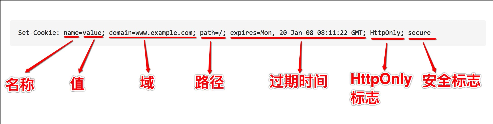

## cookie 详谈

#### 概述

`cookie` 最初被设计用来存储回话信息。

我们知道 `HTTP` 是一种无状态的请求响应，即每次请求响应之后连接会立即或延时(保持一定的有效期)断开。下一次请求再重新建立连接，那么服务器如何知道你是上一次的那个连接？这个时候就需要一种方式，告诉服务器你的身份信息，`cookie` 就是来做这件事的。

`cookie` 用来跟踪会话信息，第一次响应设置 `cookie`，以后的每次请求都会发送该 `cookie`。

#### Set-Cookie 响应头

具体流程是：

对于一个 `HTTP` 请求，服务器可以通过 `Set-Cookie` 响应头设置 `cookie`：

```
HTTP/1.1 200 OK
Set-Cookie: key=val
...
```

上面的响应头中，设置了名字为 `key`，值为 `val` 的cookie，这里需要注意的是，`key` 和 `val` 必须是 URL 编码的(`encodeURIComponent`)。在随后的请求中，浏览器通过在请求头中添加 `Cookie` 字段，携带信息给服务器：

```
GET /index.html HTTP/1.1
Cookie: key=val
...
```

#### Cookie 的限制

##### 跨域的限制

受同源策略的保护和限制，cookie 是绑定在特定的域名下的，这个限制一定程度上保护了 cookie 中的信息不回被其他域使用。

##### 数量和大小的限制

cookie 是存在浏览器中的，如果一个 cookie 不是会话cookie，那么就要保存在磁盘中。这个时候，我们需要对 cookie 所能够存储的数据量进行限制，否则恶意的存储会撑爆用户的磁盘，这个限制是从数量和大小两个维度上定义的：

###### 数量的限制

数量限制是对于每个域而言的：

* IE6限制每个域 `20` 个cookie
* IE7限制每个域最多 `50` 个cookie
* Firefox限制每个域最多 `50` 个cookie
* Opera限制每个域最多 `30` 个cookie
* Safari 和 Chrome 没有明确硬性规定

如果设置的 cookie 超过数量限制，各个浏览器的行为不同，有的会清空最早设置的cookie腾出空间，有的则会删除最近最少使用(LRU)的cookie腾出空间

###### 大小的限制

大多数浏览器限制整个 cookie 的长度大约为 4096B，即4KB。大小限制是针对所有cookie，而非单个cookie。

#### Cookie 的结构

如下图：



上图中展示了响应头的 `Set-Cookie` 字段中设置cookie的所有可选的标志：

##### 名称

cookie 的名称，cookie的名称是不区分大小写的，但是由于服务器在处理 cookie 的时候，可能会区分大小写，所以实践中，我们最好区分大小写。

注意：cookie名称必须是URL编码的

##### 值

存储在相应名称下的字符串值，该值也是URL编码的。

##### 域 - domain

指定cookie是对于哪个域有效的。

可以是子域(www.example.com)，也可不是(.example.com)，如果是主域，那么该cookie对所有子域都有效。

##### 路径 - path

指定一个域下的一个路径，cookie 只对该路径有效。

例如：`path=/books/`，假设域为：`www.example.com`，那么cookie只有 `www.example.com/books/` 才能访问，而 `www.example.com` 则不能。

##### 过期时间 - expires

表示cookie如何被删除。默认情况下，浏览器回话结束时会删除所有cookie，不过可以通过 `expires` 字段手动设置失效时间，`expires` 字段的值为 `GMT` 格式的日期字符串。

在 js 中，可以使用如下代码获取 `GMT` 格式的日期字符串：

```js
new Date().toGMTString()
```

##### 安全标志 - secure

指定后，cookie 只有使用 SSL 连接的时候才会发送给服务器。

##### HttpOnly 标志

指定后，cookie只能用于http层面，不能被客户端脚本读取。

<p class="tip">以上字段中，只有名称和值是必须的</p>

#### Cookie 操作的封装

使用 JavaScript 操作cookie，即操作 `document.cookie` 属性，这个属性设计的并不友好，这已经是众所周知的事实.....

当通过 `document.cookie` 获取 cookie 的时候，它返回一个字符串，包含所有可用的cookie信息，这个字符串又等号和分号分隔：

```
key1=val1;key2=val2;key3=val3
```

其中，名称和值都是URL编码的，所以要通过 `decodeURIComponent` 解码。

当通过 `document.cookie` 设置值时，你要设置一个字符串，这个字符串与 `Set-Cookie` 响应头的格式一样，由分号和空格分隔。

设置 `document.cookie` 并不会覆盖cookie，除非设置的cookie已经存在。而会解析字符串，将你设置的cookie添加到已存在的cookie集合中。

需要注意的是，在设置cookie的时候，名称和值也是需要URL编码的。

为了更直观和方便的操作cookie，我们通常封装对 `document.cookie` 的操作，下面的代码来自《JavaScript高程》，并做了相应的修改：

```js
var cookieUtil = {
    get: function (name) {
        var cookieName = encodeURIComponent(name) + '=',
            cookieStart = document.cookie.indexOf(cookieName),
            cookieValue = null
        
        if (cookieStart > -1) {
            var cookieEnd = document.cookie.indexOf(';', cookieStart)
            if (cookieEnd === -1) {
                cookieEnd = document.cookie.length
            }
            cookieValue = decodeURIComponent(document.cookie.substring(cookieStart + cookieName.length, cookieEnd))
        }
        return cookieValue
    },
    set: function (name, value, expires, domain, path, secure, HttpOnly) {
        var cookieText = encodeURIComponent(name) + '=' + encodeURIComponent(value)

        if (expires instanceof Date) {
            cookieText += '; expires=' + expires.toGMTString()
        }
        if (path) {
            cookieText += '; path=' + path
        }
        if (domain) {
            cookieText += '; domain=' + domain
        }
        if (secure) {
            cookieText += '; secure'
        }
        if (HttpOnly) {
            cookieText += '; HttpOnly'
        }

        document.cookie = cookieText
    },
    unset: function (name, domain, path, secure, HttpOnly) {
        this.set(name, '', new Date(0), domain, path, secure, HttpOnly)
    }
}
```

#### cookie 与 sessionStorage 和 localStorage 的区别

##### 区别

###### 数据的生命周期

cookie 可以设置失效时间，默认是关闭浏览器后失效

sessionStorage 仅在当前回话下有效，关闭标签或浏览器后失效

localStorage 除非手动清除，否则永久保存

###### 存储数据的大小

cookie 在 4kb 左右

sessionStorage 和 localStorage 在 5MB 左右，因浏览器而异

###### 与服务器端通讯

cookie 会被携带在HTTP的请求头中，所以用cookie存储太多数据会带有性能问题

sessionStorage 和 localStorage 仅存在客户端，不参与服务器通讯

正因为 cookie 会参与服务器通讯，所以 storage 是不能取代 cookie 的，因为cookie是HTTP协议的一部分

###### 易用性

cookie 的原生接口不友好，需要手动封装读写操作

storage 的原生接口还是可以接受的

##### 注意
storage在存储数据的时候，都是以字符串的形式进行保存的，所以无论你存储的是数字类型还是对象类型，当你读取的时候，你得到的将是该数据的字符串表示

##### 封装

###### cookie 的增删改查

cookie 的操作是对 document.cookie 的封装，前面我们已经讲过了。

###### storage 的增删改查

曾：

```js
localStorage.age = 24
// 等价于
localStorage.setItem('age', 24)
```

查：

```js
localStorage.age
// 等价于
localStorage.getItem('age')
```

改：

修改类似于增加，在原有的 `key` 上重新设置值就可以了

```js
localStorage.age = 24
// 修改
localStorage.age = 30
```

删：

删除全部存储的内容

```js
localStorage.clear()
```

删除某个键值

```js
localStorage.removeItem('age')
```

获取对应索引的键值：

```js
localStorage.key(index)
```


