## 从矩阵与空间操作的关系理解CSS3的transform

#### 概述

矩阵，是线性代数中涉及的内容，线性代数在科学领域有很多应用的场景，如下：

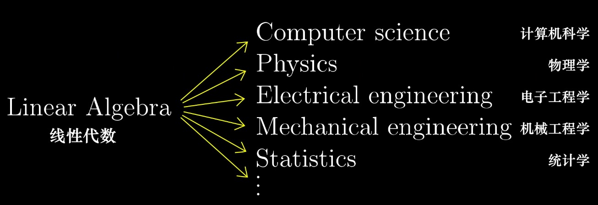

大部分同学在大学时期应该都学过一本叫做线性代数的书，如果没猜错的话，你们的老师在教学的时候大多都是概念性的灌输，比如矩阵乘法如何运算，加法如何运算，大家只要记住就ok了，但是大部分同学都不理解，*为什么矩阵的乘法要这样算？矩阵乘法的意义是什么？*，特别是我们搞计算机的，如果有做过 2D/3D 变换的同学一定听说过矩阵，比如在前端的CSS中，使用 `transform` 做 2D/3D 的变换，其中就应用到了矩阵的知识，这篇文章并不是一篇数学性质的文章，所以大家不要看了感觉一阵眩晕，这篇文章的目的在于：从矩阵与空间之间的关系讲述：为什么矩阵可以应用在空间操作(变换)。或者用一句大白话：*这玩意儿怎么就能让`div`翻过来，转过去，扭的他爹都不认识他的。*

先看一段 css 代码：

```css
/* 2D */
transform: matrix(1, 0, 0, 1, 0, 0);
/* 3D */
transform: matrix(1, 0, 0, 0, 0, 1, 0, 0, 0, 0, 1, 0, 0, 0, 0, 1);
```

上面两行 css 代码其实什么变换都不会做，因为那是变换的默认状态，即没有变换。但是其中使用到了 `matrix`，翻译成中文叫做：矩阵。如果有深入研究过 css 的同学对这两行代码也许不陌生，但是大多数人在使用 `transform` 变换时很少直接使用 `matrix` 矩阵，除非你不想让人看懂你在做些什么鸟变换...，所以更多的时候，我们会使用类似如下语法：

```css
transform: translateX(100px) rotateZ(30deg);
```

如上代码所示，一目了然，要做什么变换大家一看就知道了。但其实，这只是一个语法糖，其底层依然使用的是 `matrix`。

如果想要理解矩阵为何可以应用到 2D/3D 变换，那么只从数值水平的角度理解是不够的，你需要从几何的角度去理解矩阵，这存在着根本性的差异。而这，也就是本篇文章的真正意义。

不过，这需要我们先了解一些必要的基本概念，这些概念至关重要，首先就是向量

## 向量

#### 什么是向量

既然矩阵是线性代数的一部分，那么就不得不提到 *向量*，因为向量是线性代数最基础、最根源的组成部分，所以我们要先搞清楚，向量是什么？我说过，这篇文章不会很“数学”，所以大家不要被吓到。用一句话描述向量是什么：

> 向量：空间中的箭头

这个在大家的印象里应该很好理解，这个箭头由两个因素决定：`方向` 和 `长度`，我们先把目光局限在二维空间下，如图：

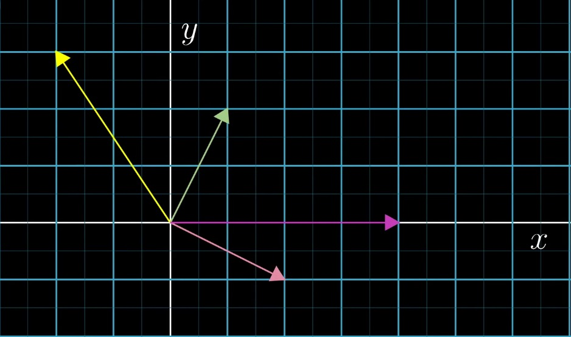

上图中，在一个坐标系中画了四个不同长度和方向的箭头，每个箭头从原点发出，他们代表了二维空间中的四个向量，在线性代数中，向量通常以原点作为起点。

如果你已经理解了“向量是空间中的箭头”这种观点，下面我们再进一步，我们重新用一句话来描述向量：

> 向量：是有序的数字列表

假设大家对坐标系的概念都有所了解，我们还是把目光局限在二维空间，在坐标系中任意选取单位长度，这样我们就能够使用一个一个的刻度来标刻这个坐标系，选取特定的方向为x/y轴的正方向，那么不难看出，每一个向量，都可以用唯一的一个坐标来表示，同样的，坐标系中的每一个坐标都对应着一个唯一的箭头(向量)，如下图：

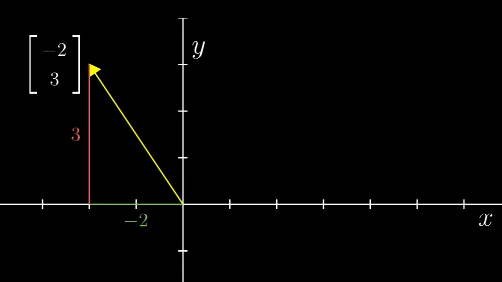

在坐标系中，由于坐标通常用来标示一个点，如 `P(2, 8)` 表示点 P 的坐标为 `(2, 8)`，为了区分点和向量，在表示向量时，我们通常把坐标竖着写，然后用一对儿中括号来描述，如上图中的：

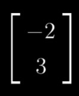

在三维空间也是一样的道理，如下图，我就不做重复的解释，唯一不同的是，每一个向量由 x/y/z 三个数字组成的坐标来表示：

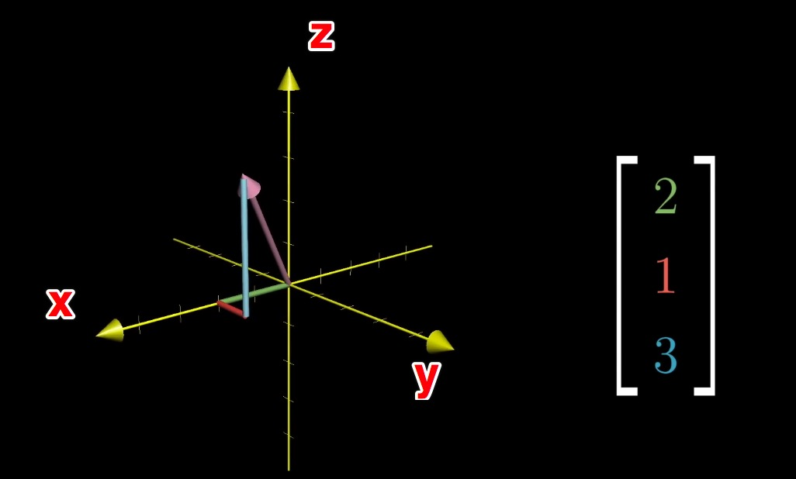

对于向量，你只需要知道它是“空间中的箭头”或者“有序的数字列表”这就足够了，怎么样？不难理解吧，我们继续往下看，在坐标系中存在一种特殊的向量，我们称之为 *基向量*。

#### 基向量

基向量，也叫单位向量，是单位长度为1的向量，如下图中：`i帽` 和 `j帽` 就是这个二维坐标系的基向量：

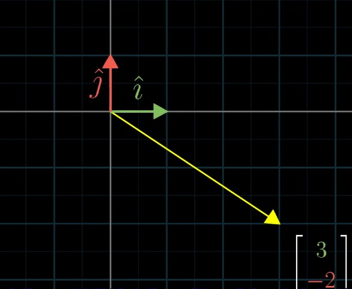

对于向量，我们就先介绍到这里，这已经足够了。除了向量，还有一个概念需要大家了解，即线性变换。

## 线性变换

“变换”本质上是“函数”的一种花哨的叫法，玩编程的都知道函数，与在数学中的概念类似，函数接收输入的内容，并输出对应的结果，如图：

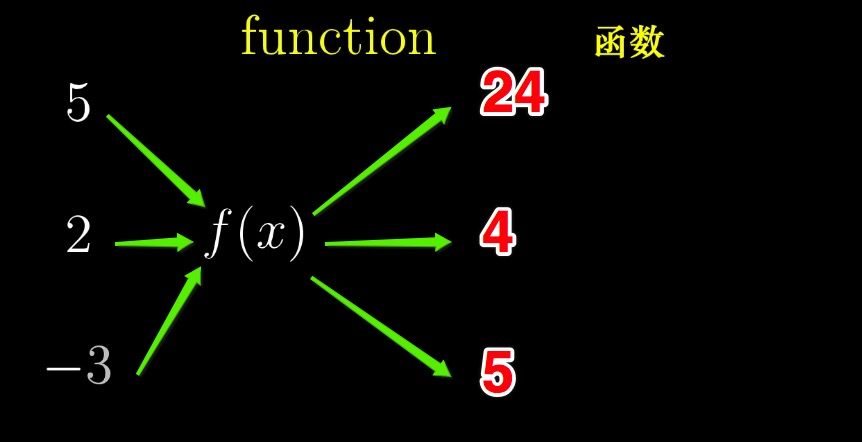

变换也是同样的道理，只不过接收向量作为输入，并输出变换后的向量：

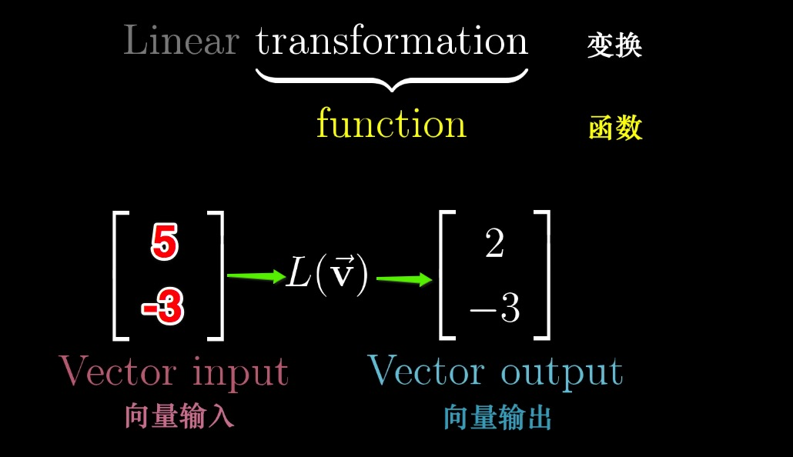

既然 “变换” 与 “函数” 本质相同，那么为什么叫变换而不叫函数呢？这实际上就暗示了我们，你可以把这个输入输出的过程，看做一个向量从初始状态到最终状态的一个变化过程，如下图：


现在，我们把情况宏观一下，目前只讨论一个向量的变换，我们知道，二维空间的一整个平面，可以看做是由无数个向量组成(或者无数个点组成，因为每一个点唯一标识一个向量，所以这里说平面由无数个向量组成)，假如这无数个向量同时做相同的变换，那其实就可以看做是平面的变换，如下图：

变换前：

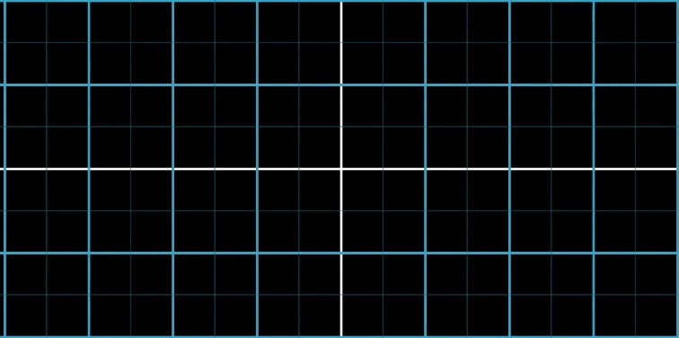

变换后：


不过，并非所有变换都叫做线性变换，线性变换必须要满足下面两个条件：
* 1、直线在变换后仍然为直线，不能有所弯曲
* 2、原点不能移动

如下变换，就不是一个线性变换，因为直线变成了曲线：

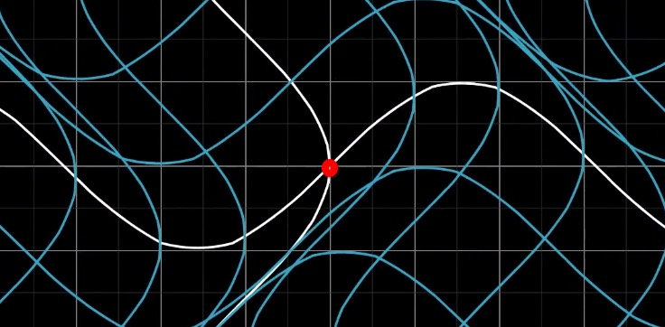

## 如何用数值描述线性变换？

在上一小节中我们知道，空间的变换也可以说是向量的变换，而向量在空间中，可以用一组有序的数字列表来表示(即向量的坐标)，所以向量变换前后，必然会引起“有序数字列表的变换”，那么我们是否可以用数字去描述变换呢？

之前在向量一节中，我们了解过*基向量*，单位长度为1，其实空间中的任意一个向量我们都可以看做是：*基向量变换后的和向量*，如下图：

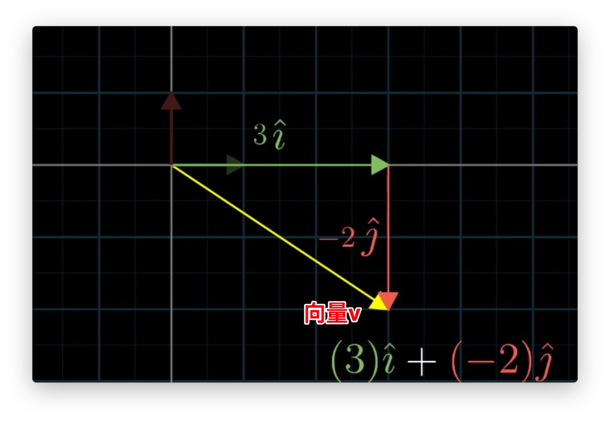

向量 <b>v</b> 的坐标是 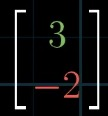，如果我们把 `3` 和 `-2` 看做两个标量，也就是纯数字，那么向量  <b>v</b> 可以看做是基向量被标量缩放后相加得到的和向量： <b>v</b> = 3<b>i</b> + (-2<b>j</b>)

了解了这些，我们现在就通过一个例子，来认识一个至关重要的事实，假如我们有向量 <b>v</b> = -1<b>i</b> + 2<b>j</b>，如下图：

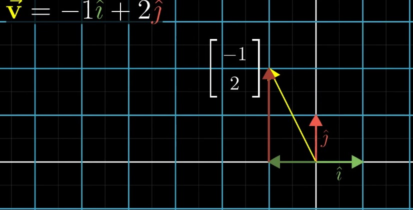

此时，基向量 <b>i</b> 的坐标是 `(1, 0)`【注意：为了方便，这里就用圆括号代表向量的坐标，下同】，基向量 <b>j</b> 的坐标是 `(0, 1)`，假设经过了某些变换之后，基向量 <b>i</b> 的坐标变为 `(1， -2)`，基向量 <b>j</b> 的坐标变为 `(3， 0)`，如下图：

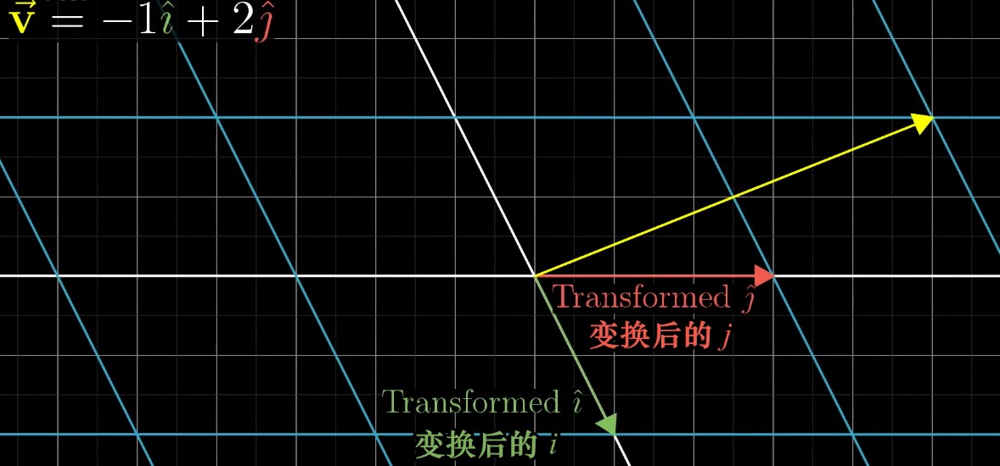

那么变换后的向量 <b>v</b> 依然满足 <b>v</b> = -1<b>i</b> + 2<b>j</b>，如下：

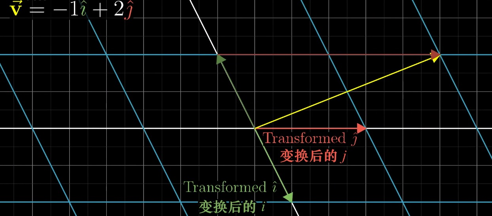

以上例子所描述的事实，实际上是线性变换的性质的推论，该性质可以从几何角度表述为：线性变换后的网格平行且等距。

既然线性变换前后都满足该线性关系：<b>v</b> = -1<b>i</b> + 2<b>j</b>

那么很容易根据变换后 `i帽` 和 `j帽` 的坐标推算出变换后 <b>v</b> 的坐标：

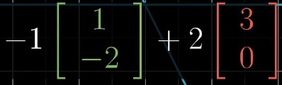

也就是 `(5, 2)`，即：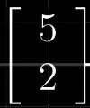

那么我们是否可以认为，给定任意一个向量，其坐标 `(x, y)`，我们可以通过变换后的基向量的坐标推断出该向量变换后的坐标呢？答案是肯定的，假如基向量变换后的坐标 `i帽` 和 `j帽` 如下图：

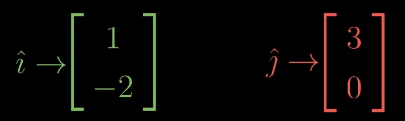

那么任意向量 `(x, y)` 在经过变换后的坐标计算如下：

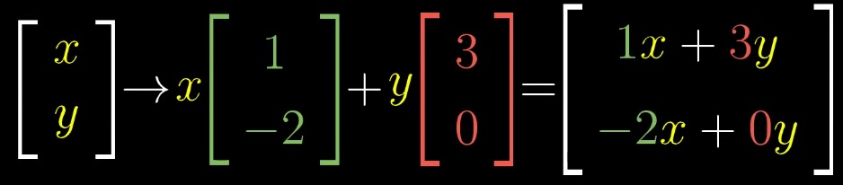

这告诉我们另外一个事实，<b>二维空间的线性变换仅由四个数字完全确定</b>，这四个数字就是基向量 <b>i</b> 变换后 <b>i帽</b> 的坐标，以及基向量 <b>j</b> 变换后 <b>j帽</b> 的坐标，如下图：

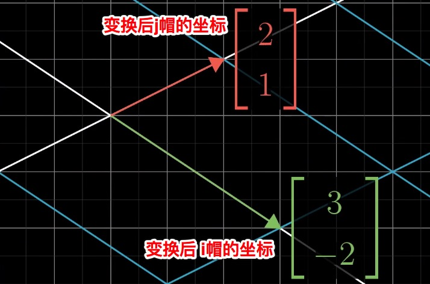

是不是很酷？只需要四个数字，我们就确定了二维空间的一个变换。通常，我们把这四个数字放到一个 `2 x 2` 的格子中，我们称之为 `2 x 2` 矩阵：

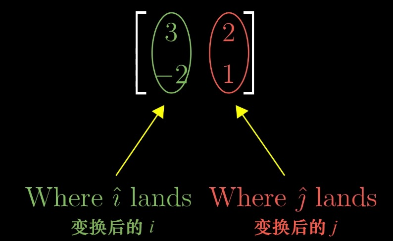

现在，当你再看到 `2 x 2` 矩阵的时候，你的第一几何直观反映应该是：它描述了一个二维空间的变换。

我们把情况一般化，如下图：

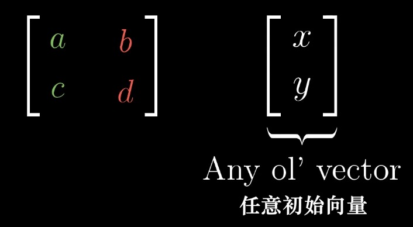

我们有一个 `2 x 2` 的矩阵 `[a, c] [b, d]`，其中 `[a, c]` 是基向量 <b>i</b> 变换后的坐标，`[b, d]` 是基向量 <b>j</b> 变换后的坐标，那么根据这个变换，以及线性变换的性质，我们可以推断出任意向量 `[x, y]` 变换后的坐标：

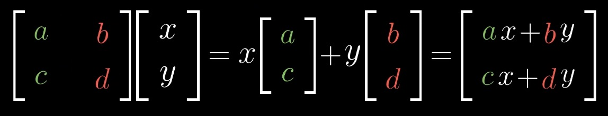

<p class="tip">
实际上，这就是数学家之所以这样定义 矩阵的向量乘法 的原因。
</p>

到了这里，让我们整理一下思路，首先，对于一个 `2 x 2` 的矩阵，你的直观几何感受应该是，第一列的两个数是对基向量 <b>i</b> 的变换，第二列的两个数是对基向量 <b>j</b> 的变换，这四个数字组成的 `2 x 2` 的矩阵，描述了一个对空间的线性变换，我们可以根据这个变换推断出任意一点(或者任意向量)变换后的坐标。

其实我么你还可以换一个角度考虑，我们就单纯的把 `2 x 2` 矩阵叫做变换，那么向量与矩阵的乘积，就要可以看做是该向量应用了这个变换。其实，这就是矩阵向量乘法的几何意义。

## 回到 CSS 的 transform

说了一大堆，是时候回到 `CSS` 的 `transform`，我们来看一下2D变换下 `transform` 属性的 `matrix` 写法：

```css
transform: matrix(a, b, c, d, e, f);
```

在文章开始，我们知道各个参数默认值如下：

```css
transform: matrix(1, 0, 0, 1, 0, 0);
```

有的同学可能会问：说好的 `2 x 2` 矩阵也就是四个数字就能确定一个二维空间变换，你这里明明有6个数啊，其实，`transform` 2D变换是一个 `3 * 3` 的矩阵，为什么是这样？因为：*位移(translate)*，前面我们说过，线性变换要满足其中一个特点：原点不能移动，但是位移却使原点发生了移动，所以 `2 x 2` 矩阵满足不了需求，只能再加一列，也就是 `3 x 3` 的矩阵。

把 `matrix` 中的 `a b c d e f` 放到一个 `3 x 3` 的矩阵中应该是这样的：

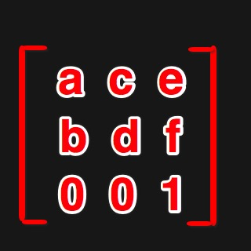

其实，在没有`位移(translate)`的情况下，`[a, b] [c, d]` 四个数字组成的 `2 x 2` 矩阵是完全可以描述2D变换的，现在我们只看由 `[a, b] [c, d]` 组成的 `2 x 2` 矩阵：

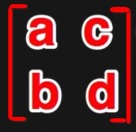

我们把 `a b c d` 四个数字使用默认值替换一下，即：`a = 1`，`b = 0`，`c = 0`，`d = 1`，如下：

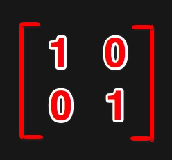

通过之前的介绍，我们在看到这个矩阵的时候，应该知道，第一列的坐标 `(1, 0)` 应该是基向量 <b>i</b> 变换后的坐标，但是基向量 <b>i</b> 在变换前的坐标就是 `(1, 0)`，也就是说没有任何变换，同理，基向量 <b>j</b> 也没有任何变换，所以说，这就是 `a b c d` 默认值设定为下面代码所示的值的原因：

```css
transform: matrix(a, b, c, d, e, f);
// a b c d 默认值为 1 0 0 1
transform: matrix(1, 0, 0, 1, e, f);
```

那么大家想想一下，我们把 `a` 的值从 `1` 变为 `2` 会发生什么？如果把 `a` 的值从 `1` 变为 `2` 那么矩阵如下：

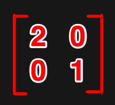

也就是说，基向量 <b>i</b> 的坐标从 `(1, 0)` 变成了 `(2, 0)`，这是在干什么？是不是基向量 <b>i</b> 被放大为了原来的二倍？举一个通俗的例子：原本单位长度1代表20px，被放大后单位长度1则代表40px。同样的，当我们把 `a` 的值从 `1` 变为 `0.5` 则意味着把基向量 <b>i</b> 缩小为原来的一半。事实上：在 `transform: matrix()` 中，修改 `a` 的值，就是在改变 `x` 轴方向的缩放比例：

```css
transform: matrix(2, 0, 0, 1, 0, 0);
/* 等价于 */
transform: scaleX(2);
```

相信大家已经知道了，修改 `d` 的值，就是改变 `y` 轴的缩放比例：

```css
transform: matrix(1, 0, 0, 4, 0, 0);
/* 等价于 */
transform: scaleY(4);
```

那么旋转要如何修改 `matrix` 中的值呢？其实，想要知道如何修改 `a b c d` 的值，只需要知道，旋转后基向量 <b>i</b> 和 <b>j</b> 的坐标就可以了，将旋转后的坐标对号填入就可以得到变换矩阵，下面，我们就来看看如何确定旋转后基向量 <b>i</b> 和 <b>j</b> 的坐标。

我们知道，在 `web` 开发中的坐标系和数学中的坐标系在正方向的选取上不太一致，在大家所熟悉的坐标系中，正方向的选取如下：

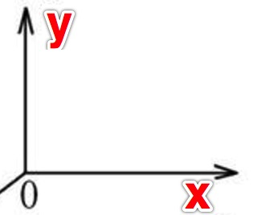

而在 `web` 开发中，坐标系的正方向选取是这样的：

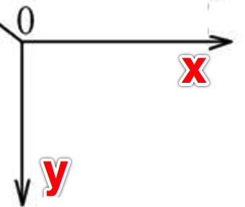

假设我们将其顺时针旋转 45 度，如下图：

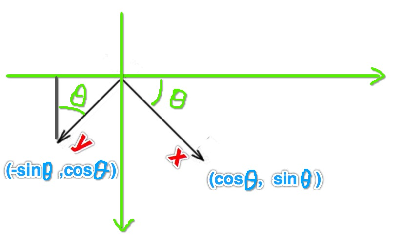

假设，上图中我们旋转的是单位向量，那么旋转后单位向量 <b>i</b> 的坐标应该是 `(cosθ, sinθ)`，单位向量 <b>j</b> 的坐标应该是 `(-sinθ, cosθ)`，所以如果用矩阵表示的话，应该是这样的：

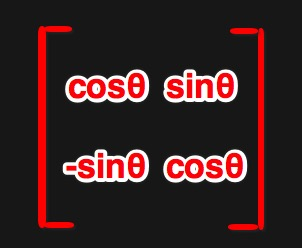

如果写到 `matrix` 里，自然就是下面这个样子：

```css
transform: matrix(cosθ, sinθ, -sinθ, cosθ, 0, 0)
```

所以，如果我们要顺时针旋转 45 度，下面两种写法是等价的：

```css
/*
 * Math.cos(Math.PI / 180 * 45) = 0.707106
 * Math.sin(Math.PI / 180 * 45) = 0.707106
 */
transform: matrix(0.707106, 0.707106, -0.707106, 0.707106, 0, 0)

/* 等价于 */
transform: rotate(45deg);
```

通过上面缩放和旋转的例子，我们已经知道了，`2 x 2` 的矩阵确实能够描述二维空间的变换，这也就是矩阵能够操作空间的原因。在 `transform` 中，除了缩放(`scale`)、旋转(`rotate`) 还有倾斜(`skew`)，对于倾斜，类似于我们寻找旋转后基向量的坐标一样，你只需要根据倾斜所定义的变换规则，找到基向量变换后的坐标就可以了，实际上倾斜对应如下规则：

```css
transform: matrix(1, tan(θy), tan(θx), 1, 0, 0);
```

大家自己拿只笔在纸上画一画应该就能搞清楚倾斜在做什么样子的变换。

无论 缩放(`scale`)、旋转(`rotate`) 还是倾斜(`skew`)，他们都不会是原点发生改变，所以使用 `a b c d` 四个数字组成的矩阵完全可以描述，但是不要忘了，我们还有一个 位移(`translate`)，这时，就不得不提到 `e f` 了，我想我不说大家也都知道了，`e f` 分别代表了 `x y` 方向的位移，事实也如大家所想：

```css
transform: matrix(1, 0, 0, 1, 100, 200)

/* 等价于 */
transform: translateX(100px) translateY(200px);
```

至此，`transform` 使用 `3 x 3` 矩阵： 来描述二维空间变换的方式，以及是如何做到的我们就算讲完了。

除了2D变换，还有3D变换，在 `transform` 中，使用 `4 x 4` 的矩阵描述3D变换，但实际上，三维空间的线性变换只需要一个 `3 x 3` 的矩阵就可以描述了，那么为什么搞了一个 `4 x 4`矩阵呢？实际上这和我们在将二维空间的变换使用 `3 x 3` 矩阵的道理是一样的，那就是位移。

我们来看一下3D变换的 `matrix` 默认值：

```css
transform: matrix(a, b, c, d, e, f, g, h, i, j, k, l, m, n, o, p);
transform: matrix(1, 0, 0, 0, 0, 1, 0, 0, 0, 0, 1, 0, 0, 0, 0, 1);
```

这十六个数字就是 `4 x 4` 矩阵的 16 个数值：

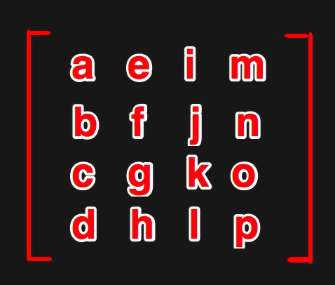

如果换成对应数字，是这样的：

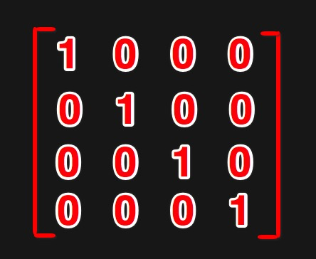

类似于我们讲解 2D 变换一样，其中由  组成的 `3 x 3` 矩阵用来描述空间的 3D 线性变换，如：`rotateX` `rotateY` `scaleZ` 等等，注意：`rotateZ` 是 2D 变换哦。

而 `m` `n` `o` 则分别用来描述位移：`translateX` `translateY` `translateZ`。