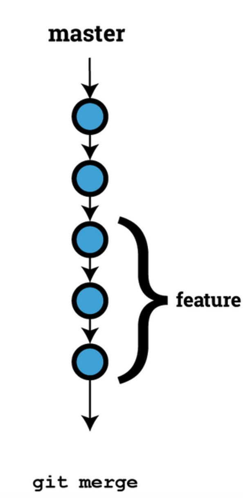
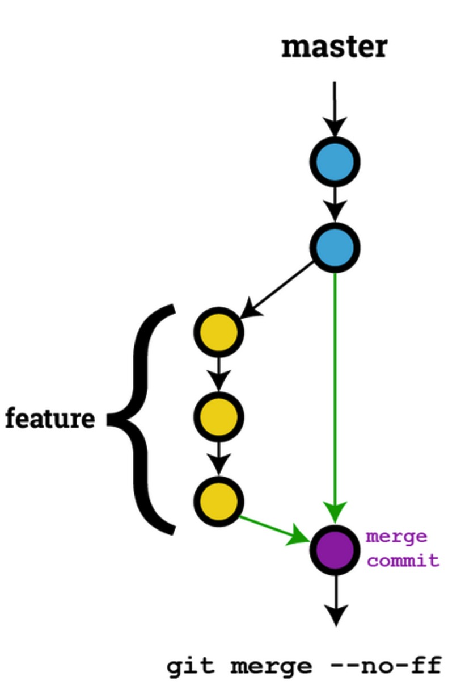
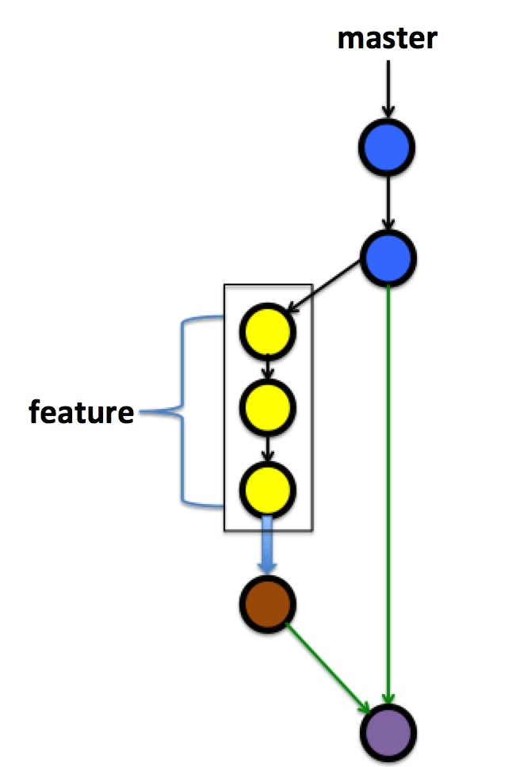

## git常用命令及技巧

#### git merge --no-ff

默认情况下，如果没有冲突那么 `git merge` 采用 `fast-forward`(快进) 的模式进行合并，所谓 `fast-forward` 指的是：不产生新的提交历史，直接移动 `HEAD` 至要合并的分支，显而易见的缺点是合并历史信息不清晰，如下图(一条线)：

所以为了保留分支的 `commit` 历史记录，我们可以采用 `--no-ff` 选项，这样合并后的历史记录图类似于这样：

#### git merge --squash

`--squash` 选项用于压缩多个“无用”的 `commit` 为一个 `commit`，效果类似下图：

