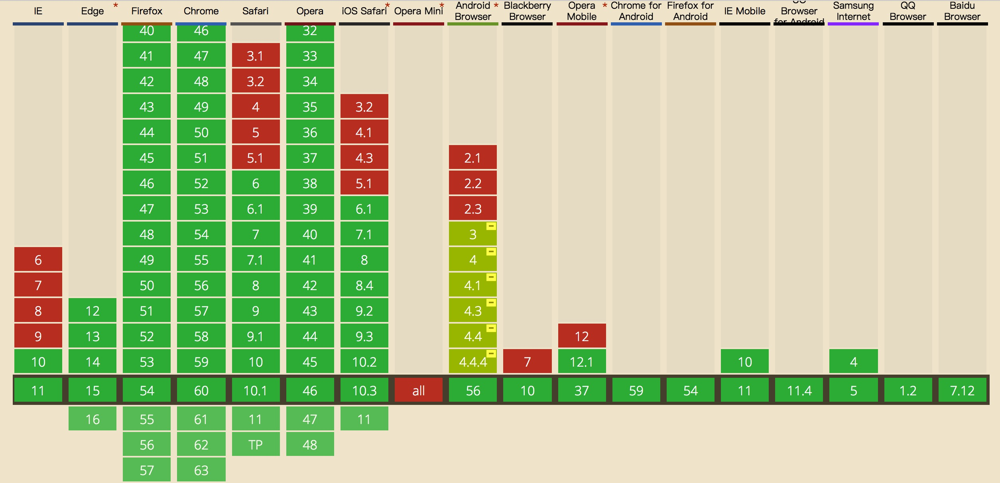
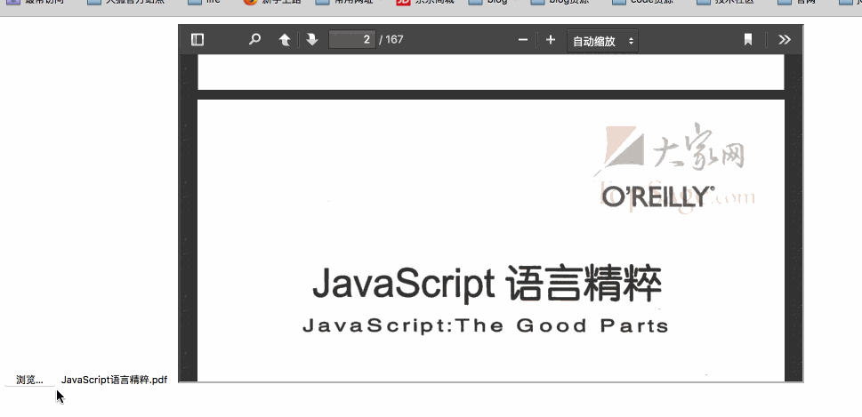

## blob

#### 简介

Blob的全称为 `binary large object` 即 二进制大对象，它是计算机界的通用术语，主要是用来存放和操作二进制数据的。在 `javascript` 中，我们可以通过 `Blob` 构造函数，创建一个 `Blob` 对象。`Blob` 是很底层的API，`File` API就是基于 `Blob` 的。`Blob` 是一个很有用的东东，正是因为有了 `Blob` 我们才可以分割文件进行分段上传，才可以 `创建Blob网址`。

浏览器兼容性如下(截止到2017-08-02)：



[可以点击这里查看最新的浏览器兼容情况](http://caniuse.com/#search=Blob)

#### Blob 构造函数

`Blob`是一个构造函数，使用方式如下：

```js
new Blob([array[, options]])
```

两个参数都是可选的：

* `array` 参数是一个数组，数组的元素可以是 `ArrayBuffer`, `ArrayBufferView`, `Blob`, `DOMString` 这些对象。

* `options` 参数是一个对象，用来对 `Blob` 进行设置，其中有两个选项可写：
    * `type` 默认值是空字符串，相当于 `MIME type`，指定 `Blob` 的类型
    * `endings` 它指定如何写出包含行结束字符\ n的字符串，默认值是 `transparent`，这意味着结尾存储在blob中，不会改变。也可指定 `native`，根据操作系统的文件系统的约定而改变。

##### Blob 对象的属性

###### size

* `{Number} size` Blob对象包含数据的尺寸，字节数
* 示例：

```js
let b = new Blob(['I love you'])
b.size  // 10
```

###### type

* `{String} type` 返回一个 `MIME type` 字符串，代表 `Blob` 中数据的类型

##### Blob 对象的方法

###### slice([start [, end [, contentType]]])

* 描述：从已有的 `Blob` 对象创建一个新的 `Blob` 对象

* 参数：
    * `{start} number` 起始位置，如果传递负数则倒数，如果传递的数值大于原 `Blob` 对象的尺寸则返回一个空 `Blob` 对象，默认值是 0。
    * `{end} number` 结束位置，不包含该位置，如果传递负数则倒数，默认值是等于 `size` 属性的值，即结束位置。
    * `{contentType}` 指定新 `Blob` 对象的 `MIME type`，默认值为空字符串

* 返回值：
    * `{Blob}` 新的 `Blob` 对象

#### 应用

预览 PDF 文件

```html
<body>
    <input type="file" id="fileinput" />
    <iframe style="width: 700px; height: 400px;" id="viewer"></iframe>

    <script>
    var input = document.querySelector('#fileinput')
    input.addEventListener('change', function () {
        // 其中 this.files[0] 为 File 的实例，但 File 继承 Blob
        var obj_url = window.URL.createObjectURL(this.files[0])
        var iframe = document.querySelector('viewer')
        iframe.setAttribute('src', obj_url)
        iframe.onload = function () {
            window.URL.revokeObjectURL(obj_url) 
        }
    }, false)
    </script>
</body>
```

效果如下：



注意：

以上代码在火狐(53.0.3)中可以在本地环境运行，在Chrome(59.0.3071.115)和Safari中必须要在服务器环境下，才能正常运行。

值得关注的是，除此应用之外，由于 `File` API继承且基于 `Blob`，所以对于 `File` 的应用，也算是对 `Blob` 的应用。

