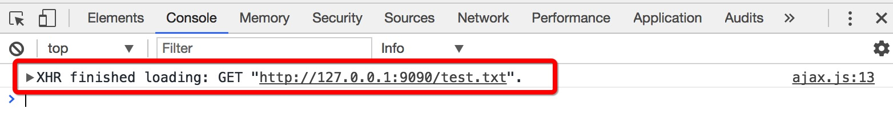
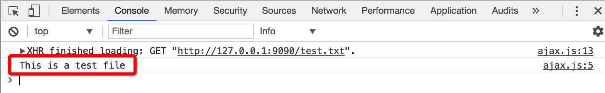

## ajax

<p class="tip">本文将不会讨论IE7之前版本浏览器的兼容实现，以标准的 XMLHttpRequest 实现</p>

#### 小例子演示 XHR 的使用

为了更好的演示，我们将会结合 Nodejs 实现一个简单的服务器端程序，假设我们有如下文件：

* index.html ---- 首页
* app.js ---- Nodejs 编写的处理请求的程序
* ajax.js ---- 被 index.html 引用的 js 文件，用来测试 XHR 代码
* test.txt ---- 存储数据，供XHR请求

来看一下 app.js 的代码：

```js
const http = require('http')
const fs = require('fs')
const path = require('path')

// 创建一个 sever 对象，监听 9090 端口
http.createServer((request, response) => {
    // 分析请求的资源路径
    let reqUrl = request.url === '/' ? '/index.html' : request.url
    let extName = path.extname(reqUrl)
    let fileName = path.basename(reqUrl, extName)
    extName = extName ? extName.substring(1) : 'html'

    // 根据分析请求的资源，返回相应的mime类型
    response.writeHead(200, {
        'Content-Type': `text/${extName}`
    })
    
    // 如果请求的不是 favicon.ico 就将资源返回
    if (reqUrl !== '/favicon.ico') {
        response.end(fs.readFileSync('.' + reqUrl))
    }
    
}).listen(9090)

console.log('Server running at http://127.0.0.1:9090/')
```

上面的代码是一段很简单的node程序，根据请求的资源返回相应的内容。此时在终端执行：

```sh
node app.js
```

访问：http://127.0.0.1:9090/ ，我们将看到 `index.html` 的内容，因为 app.js 中我们做了如下处理：

```js
let reqUrl = request.url === '/' ? '/index.html' : request.url
```

如果请求的根路径 `/`，那么返回 `/index.html` 的内容。

再来看看 `index.html` 的内容：

```html
<!DOCTYPE html>
<html>
    <head>
        <title>test ajax</title>
    </head>
    <body>
        test ajax

        <script src="ajax.js"></script>
    </body>
</html>
```

简单的不得了，仅仅引用了 `ajax.js` 文件。

这个时候，我们的服务端程序会接收到对 `ajax.js` 文件的请求，我们做了正确的处理并返回。

最后，我们还需要一个 `test.txt` 文件，我们随意写一些内容然后保存，比如我们写一句话：

```
// test.txt
This is a test file
```

下面，我们就可以使用 XHR 来请求 `test.txt` 的内容了。

编辑 `ajax.js` 文件，最简单的 XHR 使用仅仅需要三行代码，如下：

```js
var xhr = new XMLHttpRequest()
xhr.open('get', 'test.txt')
xhr.send()
```

首先实例化 `XMLHttpRequest` 对象，然后调用实例的 `open` 方法打开一个连接，最后调用 `send` 方法发送请求。注意：调用 `open` 方法并不会发送请求。

`open` 方法接受三个参数：1、要发送请求的方法类型。2、请求的URL。3、一个boolean值，代表是否异步。如果不传第三个参数，默认是异步的。

重启服务，发现控制台会有如下输出：



证明我们的请求成功了，但是我们还没有能够获取到数据，那么如何获取到数据呢？实际上，如果请求成功且数据成功返回，那么数据会自动填充到 xhr 对象的相应属性下，我们需要注意的 xhr 属性如下：

* `xhr.responseText` ---- 作为响应主体被返回的文本
* `xhr.responseXML` ---- 如果响应的内容类型(Content-Type)为 `text/xml` 或者 `application/xml`，那么这个属性将保存着响应数据的 XML DOM 文档。
* `status` ---- 响应的 HTTP 状态码
* `statusText` ---- 相应状态码的文字说明

如果请求是异步的，那么还需要注意如下属性：

* `readyState` ---- 该属性是一个 Number 类型值，分别为：0，1，2，3，4。代表请求/响应的不同阶段：
    * 0：未初始化，即还没有调用 `open` 方法
    * 1：启动，已经调用 `open`，但还没有调用 `send`
    * 2：发送，已经调用 `send`，但还没有接收到响应
    * 3：接收，已经接收到数据，但还没有接收完成
    * 4：完成，已经接收完成，数据可用了

异步的情况下，除了要注意 `readyState` 属性外，还需要一个事件，因为我们需要在这个事件处理程序中操作数据，这个事件的名字叫做：`readystatechange`，顾名思义，这个事件代表着当 `readyState` 变化时触发。一般请求下，我们只考虑 `readyState` 值变为 4 的阶段，因为这个阶段的数据已经接收完成，且可以使用了。

那么针对之前的例子，我们只需要添加如下代码，就可以获取到请求的数据：

```js
var xhr = new XMLHttpRequest()
xhr.addEventListener('readystatechange', function (event) {
    if (xhr.readyState === 4) {
        if ((xhr.status >= 200 && xhr.status < 300) || xhr.status === 304) {
            console.log(xhr.responseText)
        } else {
            console.log(xhr.status)
        }
    }
})

xhr.open('get', 'test.txt')
xhr.send()
```

我们通过 `addEventListener` 给 `xhr` 对象添加了 `readystatechange` 事件，并在里面作如下判断：

当 `xhr.readyState` 状态等于 4 时才要处理数据，接着判断状态码，只有状态码 在区间 `[200, 300)` 时或者等于 `304` 时才代表获取数据成功，正常显示数据，否则将状态码打印出来。

另外要注意，该事件必须要在调用 `open` 方法之前设置。

刷新页面，我们能看到数据已经得到了：



#### XHR 属性、方法、事件 汇总

一下列出的属性、方法以及事件，包含XHR1级以及2级的全部规范内容，由于浏览器对2级规范的实现并不完善，所以对于XHR2级规范会标注出来。

##### 属性

###### responseText

* 描述：保存中响应主体返回的文本
* 类型：`String`

###### responseXML

* 描述：如果响应的内容类型(Content-Type)为 `text/xml` 或者 `application/xml` 那么这个属性保存着包含响应内容的XML DOM文档。

###### status

* 描述：响应的HTTP状态码，如：`200`、`304` 等
* 类型：`Number`

###### statusText

* 描述：对 `status` 状态码的文本描述
* 类型：`String`

###### readyState

* 描述：一个数字，标示着当前请求/响应的某一个阶段
    * 0：未初始化，即还没有调用 `open` 方法
    * 1：启动，已经调用 `open`，但还没有调用 `send`
    * 2：发送，已经调用 `send`，但还没有接收到响应
    * 3：接收，已经接收到数据，但还没有接收完成
    * 4：完成，已经接收完成，数据可用了
* 类型：`Number`

###### 【XHR2】timeout

* 描述：可以给 `xhr.timeout` 属性设置一个数字值，代表请求多少毫秒之后超时，超时后将触发同样是XHR2级规范定义的 `timeout` 事件。
* 示例：
```js
xhr.timeout = 1000  // 1秒后超时
```

##### 方法

###### open(method, url[, async])

* 描述：启动一个请求，但不会发送。

* 参数：
    * `{String} method` 请求的方法，如：`get`、`post` 等
    * `{String} url` 请求的URL
    * `{Boolean} async` 一个布尔值，代表着是否异步发送请求，默认 `true` 异步

###### send(data)

* 描述：发送通过 `open` 方法启动的请求

* 参数：
    * `{String/FormData} data` 作为请求主体发送的数据

* 【XHR2】扩展：XHR2允许给 `send` 方法传递一个 `FormData` 实例。`FormData` 接收一个可选的参数，参数为 form 表单元素，如下：

```js
var form = document.forms[0]
var data = new FormData(form)
```

在XHR1级的时候，我们要手动序列化表单的数据然后构造一个合适的字符串。而 `FormData` 会自动序列化表单，用于创建与表单格式相同的数据用于XHR传输，这样服务端接收数据的时候就能够对传统的表单提交一视同仁，为我们节省了不少事情。

`FormData` 除了上述好处之外，也不需要我们手动设置请求头部，在XHR1级的时候，除了手动序列化表单，为了模拟真正的表单提交，我们需要设置相应的请求头部信息才行，比如：

```js
xhr.setRequestHeader('Content-Type', 'application/x-www-form-urlencoded')
```

###### setRequestHeader(key, val)

* 描述：设置要发送的请求头部信息

* 参数：
    * `{String} key` 头部字段的名称
    * `{String} val` 头部字段的值

* 注意：该方法必须要在调用 `open` 方法之后且调用 `send` 方法之前发送才能生效

###### getResponseHeader(key)

* 描述：根据指定的响应头部字段名称，获取响应头部字段的值

* 参数：
    * `{String} key` 响应头部字段的名称

###### getAllResponseHeaders()

* 描述：获取所有头部信息作为一个长字符串

* 示例：如第一小节的例子中，调用该方法将得到如下内容：
```
Date: Fri, 09 Jun 2017 08:37:44 GMT
Connection: keep-alive
Transfer-Encoding: chunked
Content-Type: text/txt
```

###### 【XHR2】overrideMimeType()

* 描述：重写响应数据的mime类型
* 意义：我们知道 `xhr` 对象拥有 `responseXML` 属性，当服务端返回的数据的内容类型是 `text/xml` 或 `application/xml` 时，数据将最为XML DOM保存在 `responseXML` 属性中，但是，如果服务端响应的内容类型是：`text/plain`，而事实上数据确实是可以作为 XML 解析的，此时 `responseXML` 属性为空，为了重新让该属性保存着能够用于 XML 解析的数据，我们就可以使用 `overrideMimeType` 方法重写mime类型：

```js
var xhr = new XMLHttpRequest()
xhr.open('get', 'xml.php')
xhr.overrideMimeType('text/xml')
xhr.send()
```

##### 事件

###### readystatechange

* 描述：当 `xhr.readyState` 属性值变化时触发。
* 注意：该事件必须要在调用 `open` 方法之前设置

###### 【XHR2】timeout

* 描述：当请求在 `xhr.timeout` 属性所设置的规定事件内没有完成，将触发该事件，代表请求超时

##### 进度事件

###### loadstart

* 描述：接收到响应数据的第一个字节时触发

###### progress

* 描述：接收响应数据期间持续触发
* 事件对象的重要属性：
    * `event.lengthComputable` ---- 一个boolean值，表示进度信息是否可用
    * `event.position` ---- 表示已经接收的字节数
    * `event.totalSize` ---- 表示根据 `Content-Length` 响应头部确定的预期字节数

###### error

* 描述：请求发生错误时触发

###### abort

* 描述：调用 `xhr.abort()` 方法终止连接时触发

###### load

* 描述：响应数据接受完毕时触发
* 注意：实际上 `load` 事件是为了取代 `readystatechange` 事件而定义的，`load` 事件的好处是，我们不需要手动判断 `readyState` 属性的值。

###### loadend

* 描述：触发 `error`、`abort`、`load` 事件后触发

#### ajax的优缺点

###### ajax的优点

* 无刷新更新数据，不影响用户交互
* 传统方式每次与服务器交互都返回整个HTML页面内容，ajax仅获取必要的数据，减少带宽
* ajax是前后端分离能够实现的重要桥梁

###### ajax的缺点

* 越过浏览器的历史记录，页面无法返回前一个状态
* 不利于搜索引擎优化(SEO)