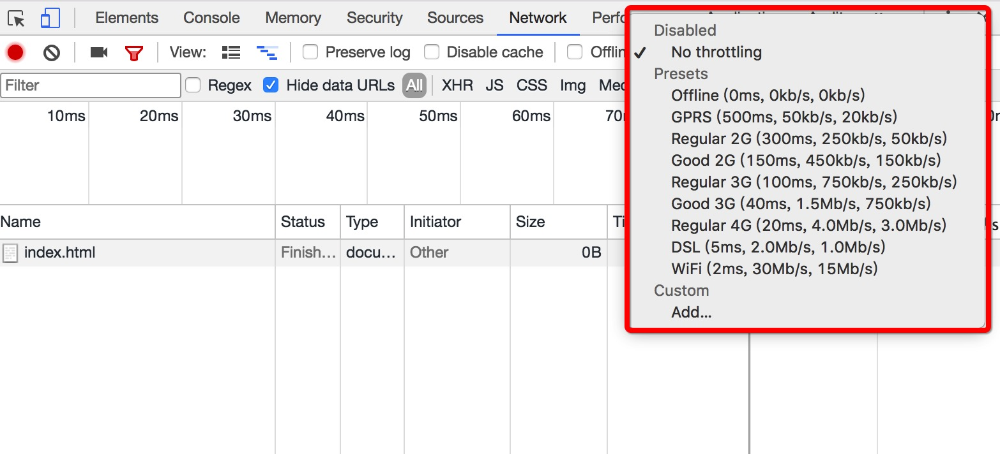

## H5 性能优化整理

#### H5 性能指标

我认为 H5 的性能指标包含三个维度：

* 完成首屏渲染的时间
* 渲染完成后用户的交互体验
* 应用的耗电情况

针对第一点：*完成首屏渲染的时间*，一个好的网站，应该在 `2-4` 秒内完成渲染，即展示给用户。我们可以设立一个目标，比如3秒内完成首屏渲染。

针对第二点：*渲染完成后用户的交互体验*，H5 站点经常会有纯H5的交互组件，如模拟滚动、模拟Picker选择器等。这些组件的体验是否流畅，是否会出现卡顿等问题，也是严重影响用户体验的因素，需要我们考虑。

针对第三点：*应用的耗电量*，正如第二点所说，为了尽可能的避免卡顿，通常我们会启用3D硬件加速，但大面积的启用3D硬件加速会导致耗电量过大的问题，我们需要一个衡量变通的方案。

综上所述，我们要结合每一个性能指标，以及H5应用的实际场景，给出合理的优化方案，下面我们一个一个来谈。

#### 最小化完成首屏渲染的时间

要缩短完成首屏渲染的时间，那我们必然需要知道一个问题，哪些因素会影响完成渲染的时间，首先网速是一个必不可少的关键因素，网速快资源下载的快，那么最终完成渲染的时间必然要短，反之亦然。除了网速，资源的大小也是一个重要考量因素，如果网速是固定的，那么当然资源越小越好。除此之外，浏览器解析代码渲染页面的过程也是需要时间的，我们要尽可能的优化我们的代码，如尽可能避免引起浏览器的 Reflow/Repaint 等。为此我推荐大家从以下一个关键因素优化：

##### 减小资源体积

在弱网情况下如 2G/3G 网络，根据 chrome 浏览器开发者工具的 `Network` 中的限流控制，我们可以做出相应的衡量，如图：

2G弱网的平均网速约为 300kb/s，3弱网的最差网速为 250kb/s，兼顾 2G/3G，我们可以去 250kb/s 为标准，那么想要在 3s 内完成渲染，资源的体积一定要小于 `250kb/s * 3s = 750kb`。

* 压缩HTML、CSS、JavaScript，目前构建工具可以帮我们解决这个问题
* 压缩图片，(webP格式的图片要比同等质量的jpg图片小很多)

##### 减少HTTP请求的数量

手机浏览器能同时响应请求的数量为 4-6 个（Android4个，IOS5后支持6个），首次加载的资源数量要在 4 个以内。

* 合并JS、CSS资源
* 使用雪碧图

##### 缓存静态资源

这个可能是对站点优化最为显著的优化措施了。具体的缓存方法和原理，可以查看：

* [强缓存与协商缓存](/note/http/cache)

##### 关键路径优化

可以查看：[数据直出与服务端渲染的首屏优化](/note/performance/ssr)

##### 按需加载

如果页面的内容过多，我们是可以考虑只加载首屏的内容，其他内容等用户真正需要的时候再加载，比如滚动加载、懒加载等等。

##### 避免重定向

重定向严重影响资源的加载速度，一定要避免。

#### 渲染完成后用户的交互体验

待续......

#### 应用的耗电情况

待续......