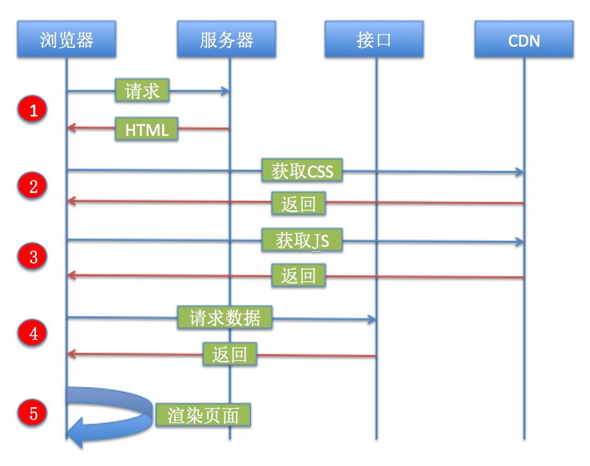
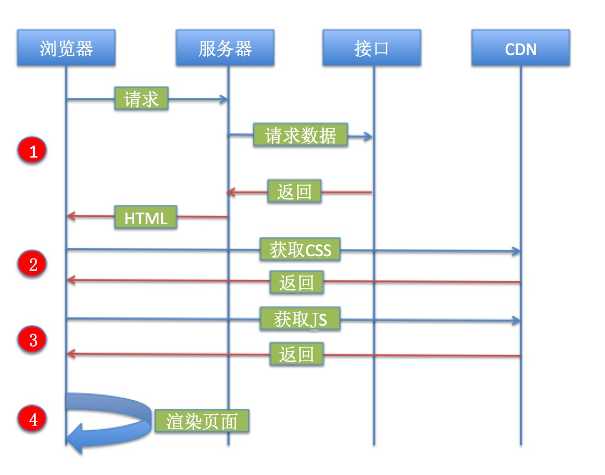
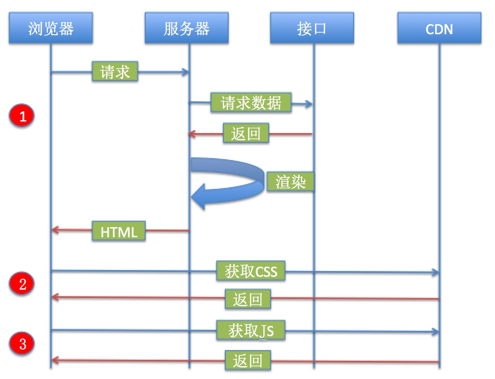

## 数据直出与服务端渲染的首屏优化

在web开发初期，对于前端来讲，存在感是很小的，基本上是服务端给什么，前端就展示什么，这个时候一般以服务端MVC开发模式为主。前端浏览器单纯的展示由服务端吐出的数据。

随着技术的发展，ajax的出现改变了这一现状，使得SPA(单页应用)受到了极大的推崇，其实究其原因，就是因为ajax带来的用户感知友好。说白了就是能不刷新页面的就不要刷新。这个时候，逐渐形成了一套前后端分离的方案或开发模式，这套开发模式也使得前端和后端开发的解耦，一定程度上提升了开发效率。

而最近，似乎服务端渲染又被推崇了起来。其实无论是前后端分离也好，服务端渲染也罢，我们最终的目的只有一个：让应用的性能更佳，让用户的体验更好。

这篇文章就从应用的加载已经渲染的过程，谈谈服务端渲染对应用的优化。

#### 纯前后端分离的做法

用一张图来表示纯前后端分离的做法：



基本分成五个步骤，解释如下：

* 一：首先浏览器要向从服务器获取html页面，然后浏览器开始解析页面。
* 二：通常在解析页面的时候，在html标签的头部会遇到 `<link>` 的CSS资源，这个时候可能会向CDN加载CSS资源。
* 三：遇到页面底部的js资源，同样要加载js资源。
* 四：要等到js资源加载完成后，才能够通过ajax请求服务端的接口，获取数据。
* 五：当取到数据之后，渲染页面。

首先，我们分析一下这个过程，至少要发送四次http请求才能开始渲染页面：

* 第一次：请求 html 页面
* 第二次：请求 css 资源（假设只有一个css资源需要加载）
* 第三次：请求 js 资源（假设只有一个js资源需要加载）
* 第四次：请求数据

除了需要四次http请求之外，我们应该注意另外一件事，就是渲染页面的时机，是在第五步才开始进行的。那么这个过程有什么办法优化吗？答案是有的。

#### 数据直出

在之前的那张图片中，我们可以清晰的看到，第一步请求 `html` 文件，第四步才能够请求数据，那么我们可不可以把第四步合并至第一步呢？换句话说，我们服务器在返回html内容的同时，把数据也一并返回，拼接到 html 字符串上，比如插入到 `body` 标签的自定义属性上，比如：

```html
<body data-render-data="{boj:{a: 1}}"></body>
```

这样，我们在第四步判断如果服务器已经把数据给我们返回了，就不需要再请求数据了，即减少了一次 http 请求的开销，用一张图表示这个过程：



那么这样做的收益如何？其实等价于把外网发送的http数据请求该为了服务器内网对数据的请求，外网的网络环境相当不可控，甚至极其恶劣，但我们内网的速度极快且稳定。

#### 服务端渲染

在上一小节数据直出中我们知道，服务端可以把html字符串和数据一并给我们返回，那么可不可以再进一步：服务端将html和数据进行渲染，将渲染好之后的html字符串吐给前端，直接展示，来看下面这张图：



这样做和简单的数据直出有什么好处？答案是更快的展示首屏的内容给用户，原因如下：

简单的数据直出，要等到CSS和JS资源都加载完之后，才进行渲染展示。而ssr在第一步就以及渲染完成，只要CSS资源加载完就可以按照预定的样式展示了。这无疑会对展示的速度提升很多，甚至，如果CSS资源不大的话，我们可以考虑将CSS通过 `style` 标签内敛到html里，这样又减少了请求CSS资源的时间。

当然，这样考虑整体资源的大小，一般情况下，首屏加载的资源要小于1000kb。所以根据资源情况来决定采用什么样的措施。

目前，React 和 Vue 等主流的前端框架都已经支持服务端渲染（ssr），如果应用得当的话，是可以有效对首屏加载时间进行一定程度的优化的。

