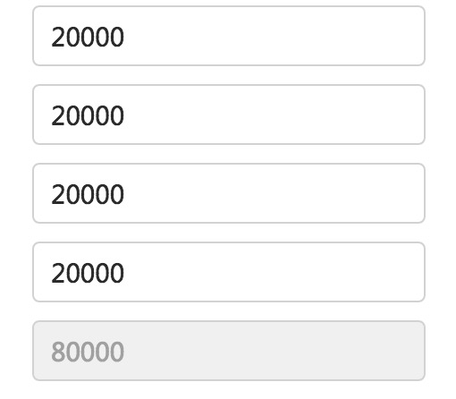

## Vue 和 React 使用方式的对标

这篇文章将接地气的从开发使用角度对比 `Vue` 和 `React`，带有严重个人偏好，慎入。

#### 关于组件的创建方式

先看看两者如何创建组件：

首先对于 `Vue`，你只需要像引入 `jQuery` 一样引入 `Vue` 就行了，然后我们可以使用 `Vue.component` 注册全局组件：

```js
Vue.component('list', {
    // 组件选项
})
```

也可以使用 `Vue` 构造函数的 `components` 选项注册局部组件：

```js
new Vue({
    template: '<list></list>',
    components: {
        'list': {
            // 组件选项
        }
    }
})
```

但是你知道吗少年，你想像引入 `jQuery` 一样直接使用 `React`，不介入任何构建系统，让浏览器直接运行，可能有点麻烦，首先，你得先把下面这两个文件引入：

```js
<script src="https://unpkg.com/react@15/dist/react.min.js"></script>
<script src="https://unpkg.com/react-dom@15/dist/react-dom.min.js"></script>
```

然后你是不是要创建组件啊少年？那你就老老实实再引入一个 `create-react-class.js`
然后你就可以这样去创建一个组件了：

```js
var MyComponent = createReactClass({
    render: function() {
        return <h1>Hello, {this.props.name}</h1>
    }
})
```

这还没完，为了能让浏览器直接运行代码，你就不能使用 `jsx` 语法，`React` 官方文档也告诉你了，反正 `jsx` 语法最终都被转换成函数，类似下面这样：

```html
<div>Hello {this.props.toWhat}</div>
// 上面的jsx转换为
React.createElement(Hello, {toWhat: 'World'}, null)
```

既然如此，那你直接写 `React.createElement(Hello, {toWhat: 'World'}, null)` 不就可以了.......也是日了狗了，要是都用这种语法去写一个视图，那程序员的寿命估计是要减半了。即使你可以通过引入其他垫片库来使你可以使用 `jsx` 语法，那你想象一下这么做了之后会不会出现性能问题？无论是引入文件的体积还是代码运行的性能。

所以没人傻到不让构建系统参与的情况下使用 `React`，但你完全可以无构建系统的情况下使用 `Vue`，所以如果你要做以下小东西，没必要搭建构建系统，那 `Vue` 是首选。

如果允许使用构建系统的话，那么两者都可以换个玩法，比如 `Vue` 可以使用单文件组件：

```js
<template>
这里是模板
</template>
<script>
export default {
    // 组件选项
}
</script>
<style scoped>
组件化的样式
</style>
```

上面的 `.vue` 单文件组件，在 `webpack` 配合 `vue-loader` 的情况下你真的只需要专心写你的视图，写你组件的逻辑就可以了，什么都不用关心。

`React` 则这样：

```js
import React from 'react'

export default class SomeComponent extends React.Component {
    // 组件的逻辑
}
```

在上面的对比中大家要注意一点，在 `Vue` 中，无论你使用什么方式创建组件，组件的选项都是一模一样的，但是 `React` 则不然，比如 `React` 在使用 `ES6` 语法创建组件的时候，初始化状态要这么写：

```js
export default class SomeComponent extends React.Component {
    state = {
        a: 1
    }
}
```

但是如果你不使用 `ES6`，你就要使用 `getInitialState` 方法：

```js
var MyComponent = createReactClass({
    getInitialState: function () {
        return {
            a: 1
        }
    }
})
```

除此之外，在 `React` 中使用 `ES6` 和不使用 `ES6` 还有很多地方是不一样的，比如 `声明默认 Props` 的方式也不同，给事件绑定函数时要注意 `this` 的问题等等，具体看[官方文档吧](https://facebook.github.io/react/docs/react-without-es6.html)

然后再强调一下：在 `Vue` 中，无论你怎么写，写法都只有一种：`Only one`。

另外还应该强调一点的是：`Vue` 单文件组件还对 `CSS` 进行了组件化管理，使用 `scoped`。同时单文件组件允许你使用其他模板语言来写模板，允许你使用css预处理器来写样式。

#### 关于 State

再来看看两者的数据状态。

在 `React` 中，`State` 是组件自身的数据状态，其实在 `Vue` 中也是，两者的写法略有不同：

`React` 如下：

```js
export default class Xxxx extends React.Component{
    state = {
        a: 1
    }
}
```

或者：

```js
export default class Xxxx extends React.Component{
    constructor (props) {
        super(props)
        this.state = {
            a: 1
        }
    }
}
```

当然，非 `ES6` 版本的这里就不写了。。。。

对于 `Vue`，很简单：

```js
export default {
    data () {
        return {
            a: 1
        }
    }
}
```

在 `data` 方法中返回一个对象就可以了，这就是数据。之前我们也谈过，无论采用何种方式使用 `Vue`，你就都这么写就完了。

我们知道，数据变化最终会反应到视图上，我们的应用无非就是和数据打交道，所以很多场景下，我们都要改变数据，进而改变视图，在 `React` 中，改变数据你要使用 `setState()` 方法：

```js
this.setState({
    a: 3
})
```

当我们的对象很复杂的时候，比如：

```js
{
    obj: {
        a: {
            b: 1
        }
    }
}
```

那你需要这样 `setState`：

```js
this.setState({
    obj: {
        a: {
            b: 3
        }
    }
})
```

想象一下，比上面复杂的数据多了去了，你这么 `setState` 的话，会死人的。所以 `React` 让你使用这玩意：[immutability-helper](https://github.com/kolodny/immutability-helper)。行了，去学吧，学完了赶紧去用。

在 `Vue` 中呢？你只需要这样：

```js
obj.a.b = 3
```

对，就这么简单。不过导致两者在设置状态方便会有这么大差异的原因有两个：

第一：两者触发视图更新的方式不一样，`Vue` 底层做了数据劫持，当你改变数据之后，`Vue` 会重新 `re-render` 然后通过 `Virtual dom` 的 `diff` 算法来更新视图。也就是说你什么都不用做，只管改变数据就好了。而 `React` 是函数式的思想，状态与视图是一种函数关系：

```js
view = f(state)
```

所以你要是显示的调用 `setState` 并将新的数据传递给该函数，然后 `React` 根据新的数据状态生成新的  `Virtual dom`，然后使用 `Virtual dom` 的 `diff` 算法来更新视图。

还有一个细节要注意，`Vue` 中的数据状态，我们直接通过组件实例的 `this` 就能访问，这是因为 `Vue` 做了一层代理。`Vue` 中也可以通过 `this.$data.xxx` 来访问数据，就像 `React` 中的 `this.state.xxx` 一样，但这样代理的设计无疑更加人性化，这层代理也使得我们在写模板的时候直接写变量的名字即可如：

```html
<div>{{obj.a}}</div>
```

而不需要写：

```html
<div>{{this.$data.obj.a}}</div>
```

#### 关于 Props

`Props` 是父组件向子组件传递数据的方式，`Vue` 和 `React` 在父组件中为子组件传递 `Props` 的方式是一样的，只是具体语法略有差别：

##### Props的传递 -- 是否驼峰

在 `React` 中，因为写的是 `jsx`，所以采用驼峰的方式：

```html
<Somecomponent showModal={this.state.isShow} title="模态框" />
```

在 `Vue` 中，由于 `Vue` 既支持模板又支持 `jsx`（在 render 函数中写），所以如果你手写 `render` 那和 `React` 一样（这里的一样指的是jsx的语法形式，具体两者还是有区别的，[点击这里查看](https://github.com/vuejs/babel-plugin-transform-vue-jsx#usage)），如果你使用模板，那么 `Props` 要采用中横线的方式，这是因为 HTML 特性是不区分大小写：

```html
<Somecomponent :show-modal="isShow" title="模态框" />
```

##### 字符串字面量 和 动态数据

上面的代码大家可能已经注意到了，在传递动态数据和字符串字面量的时候，两者的语法略有不同：

在 `React` 中使用 `{}` 定义动态数据，使用引号定义字面量。

在 `Vue` 中无论传递的是动态数据还是字面量都使用引号，不同的是，传递动态数据的 prop 属性前面加了一个 `:` 号。这其实是 `Vue` 中 `v-bind` 指令的缩写。

有一个细节之前也提到过：传递动态数据的时候，`React` 中要写一大串：`this.state.xxx` 或者 `this.props.xxx`，所以会有很多最佳实践告诉你使用 `ES6` 的结构赋值。而 `Vue` 中无论你要传递的是组件自己的数据状态，还是传递从父组件接收到的props，你都无需像React那样访问 `this.state` 或者 `this.props`，仅仅需要写变量的名字即可。因为这些作用域相关的东西，`Vue` 已经帮你做了。

其实这也不能怪 `React`，这只能叫做 `jsx` 与 `模板` 的对比，类似这种小细节其实有很多。我想表达的是：`模板在一些情况下真的好于jsx，并且这种情况占了大多数。对于那些jsx占优的情况，我想对你说：Vue 也是可以写jsx的，你有两种弹性的选择`。

##### Props的接收、校验、默认值

在 `React` 中接收 `Props`，使用 `this.props.xxx` 直接访问就行，可以像下面代码这样对 `Props` 指定默认值和校验：

```js
import PropTypes from 'prop-types'

export default class Some extends React.Component {
    // 校验
    static propTypes = {
        show: PropTypes.bool
    }
    // 默认值
    static defaultProps = {
        show: false
    }
}
```

大家已经看到了，你需要引入 `prop-types`。

在 `Vue` 你必须在子组件中使用 `props` 选项显示的接收由父组件传递过来的prop，指定默认值和对 `props` 的校验都写在 `props` 选项中：

```js
// 引自官方文档
export default {
    props: {
        // 基础类型检测 (`null` 意思是任何类型都可以)
        propA: Number,
        // 多种类型
        propB: [String, Number],
        // 必传且是字符串
        propC: {
            type: String,
            required: true
        },
        // 数字，有默认值
        propD: {
            type: Number,
            default: 100
        },
        // 数组/对象的默认值应当由一个工厂函数返回
        propE: {
            type: Object,
            default: function () {
                return { message: 'hello' }
            }
        },
        // 自定义验证函数
        propF: {
            validator: function (value) {
                return value > 10
            }
        }
    }
}
```

对于 `Props`，两者的方式我都接受，不过在开发 `Vue` 组件的时候，我喜欢将 `Prop` 验证写在单独的文件里进行管理。但是在写 `React` 组件时：我发现我这么干起来很不爽。

#### 关于表单

一提到表单，不得不说是：写这篇文章的起因，就是因为在 `React` 中操作表单根本没有办法和 `Vue` 抗衡，做业务时常常带着抵抗的心理一边写着 `React` 的代码，一边想念 `Vue`。

其实，这一切的根本原因，还是因为 `React` 是 `jsx`，而 `Vue` 的模板拥有指令系统，并且专门对表单做了很多的增强，使得你将更多的注意力集中在业务逻辑。

在 `React` 中表单元素诸如：`<input>`、`<textarea>`、`<select>` 等有两种形式或者叫法：`Controlled Components` 和 `Uncontrolled Components`，即受控和不受控的，先说说受控制的，说白了就是在 `React` 看来，这些元素也是组件，当你给这些表单元素写了 `value` 属性时，这里的 `value` 是被看做传递给子组件(即表单元素)的 `props`，那这个值当然不应该由子组件(即表单元素)修改，否则违背了单向数据流的理念，所以你要监听 `onChange` 事件使用 `setState` 手动修改数据状态进行交互，否则任何交互都会被屏蔽忽略。

当你的表单元素较多的时候，官方的意思是让你给表单元素添加 `name` 属性值，然后让这些表单元素监听同一个事件函数，通过 `event.target.name` 区分。这其实就是免得让你手动传参区分，你自己通过参数也能控制，只不过要注意消除魔术字符串。

如果你的表单元素不添加 `value` 属性，那么就是不受控制的，你可以通过 `ref` 获取到 `DOM` 元素操作他，你可以通过 `defaultValue` 设置初始值。

对于 `React` 的表单，上面这写文字的介绍，就已经涵盖了。总结一下就是：为了保证单向数据流，限制了你，没有任何增强。

再来看看 `Vue`，`Vue` 专门为表单做了增强。所有的表单都可以通过 `v-model` 指令进行数据的双向绑定。有的人会说了，这是不是违背了单向数据流动的理念？其实并没有，原因是：`v-model` 只是语法糖，它把事情都帮你做了。`Vue` 对表单的增强真的可以让你很专注很轻松的处理业务逻辑，谁用谁知道，具体都做了哪些增强：[来看文档](https://cn.vuejs.org/v2/guide/forms.html)。

举一个很简单的例子，如下图：



需求很简单：最后一个输入框的值是由前4个输入框的值相加得来的，当输入改变时，自动计算。

用 `Vue` 实现上面的需求很简单：

```html
<template>
    <div>
        <input v-model.number="val1" />
        <input v-model.number="val2" />
        <input v-model.number="val3" />
        <input v-model.number="val4" />
        <input v-model.number="total" />
    </div>
</template>
<script>
export default {
  data () {
      return {
          val1: null,
          val2: null,
          val3: null,
          val4: null,
      }
  },
  computed: {
      total: function () {
          return this.val1 + this.val2 + this.val3 + this.val4
      }
  }
}
</script>
```

我们使用 `Vue` 中的 `计算属性`，除此之外，由于输入框得到的值永远都是字符串，我们在使用 `v-model` 指令绑定数据时指定了 `.number` 修饰符，这保证了我们得到的数据为数字，模板清晰易看，逻辑简洁条理清晰。然后再想想用 `React` 如何实现？

谁要是可以用 `React` 写出来比上面 `Vue` 简短清晰的实现，记得联系我，正好我学习一下。顺便在北京动物园给你买个摊位，我们花钱去参观你，一个新的物种诞生了，下期走近科学就播你，走近科学就是走进你。

#### 关于事件

就像对表单的增强一样，`Vue` 同样对事件做了增强，在 `Vue` 中使用 `v-on` 或者简写 `@` 来绑定事件，如：

```html
<div v-on:click="fn"></div>
<div @click="fn"></div>
```

这里的 `fn` 就是当事件发生时要触发的函数，这个函数你需要定义在 `Vue` 的 `methods` 选项里：

```js
export default {
    // ...
    methods: {
        fn: function () {
            // ...
        }
    }
    // ...
}
```

定义在 `methods` 选项里的方法就像定义在 `data` 中的数据一样，可以用过实例的 `this` 对象直接访问。在 `Vue` 中你也不需要关心 `this` 指向的问题，但是在 `React` 中，你要这样：

```js
render () {
    return (
        <div onClick={this.handle.bind(this)}></div>
    )
}
```

`Vue` 对事件的增强中，非常人性化的一点就是 `修饰符`，比如：

事件函数我只想执行一次，你只需要这样：

```html
<div @click.once="fn"></div>
```

阻止事件冒泡和阻止事件默认行为可以串连使用两个修饰符：`.stop` 和 `.prevent`：

```html
<div @click.stop.prevent="fn"></div>
```

除此之外还有其他非常使用的修饰符，对键盘事件和键码都为开发者提供了极其人性的设计，具体[查看这里](https://cn.vuejs.org/v2/guide/events.html)。

接下来我们再说说在 `React` 中，如何实现这些事：`自己做`。

另外还有一点需要对比一下 `React` 和 `Vue`，那就是：父组件中如何监听子组件发射过来的事件？

在 `React` 中，事件是与 `props` 结合在一起的，事件函数通过 `props` 传递，所以你需要在子组件中接收这个 `prop`，当事件发生的时候，手动去触发：

父组件如下：

```js
render () {
    return (
        // onClick 仅仅是一个 prop，并不是浏览器原生事件
        <Test onClick={this.handle.bind(this)}/>
    )
}
```

然后在子组件中真正的浏览器原生事件中，通过 `props` 调用由父组件传递过来的事件函数：

```js
render () {
    return (
        // 这里的 onClick 才是浏览器的原生事件
        <div onClick={this.props.onClick}>click me</div>
    )
}
```

这种感觉就像把一个函数作为参数，传递给另一个函数，然后另一个函数拿到这个参数再传给下一个函数，最终才被执行。

而在 `Vue` 中，拥有自定义事件系统，你只需要使用 `v-on` 或者 `@` 符在子组件上像监听原生事件一样监听自定义事件即可：

父组件:

```html
<Test @some-event="fn" />
```

然后在子组件中你想要触发该事件的地方发射该事件即可：

```js
this.$emit('some-event')
```

#### 关于性能

框架的性能到底怎么样，这是衡量一个框架性能的直接标准。但另外一个不可忽视的因素是：`为了保证性能，你需要做什么？`。很遗憾：在这一点上，我觉得 `React` 必败无意。

使用过 `React` 或者对 `React` 性能有过关注的同学应该都知道，当一个组件的状态变化后，`React` 会以该组件作为根组件，重新渲染整个子组件树。但在这颗组件树中，并不是所有组件都需要重新渲染，甚至不需要做 DOM diff 的。而 `React` 也提供了 `shouldComponentUpdate` 方法，通过其返回值让 `React` 知道该组件需不需要 diff。这就需要开发者在开发业务应用的同时，为了保证性能，你需要话费一定的心思来处理这方面的问题。

`React` 甚至“贴心”的为你提供了 `React.PureComponent`，实际上就是替你实现了 `shouldComponentUpdate`，不过你需要知道，它仅仅帮你进行了浅比较。很多时候，你还是需要自己实现 `shouldComponentUpdate`，对比前后 `props` 的情况，这就需要你在处理数据引用的时候要小心，比如父组件我们这样定义：

```js
export default class Some extends React.Component {
    state = {
        foo: {
            bar: 'baz'
        }
    }

    handleOnClick () {
        let newFoo = this.state.foo
        newFoo.bar = 'newBaz'
        this.setState({
            foo: newFoo
        })
    }

    render () {
        return (
            <Test onClick={this.handleOnClick.bind(this)} foo={this.state.foo} />
        )
    }
}
```

在父组件中，我们向子组件 `<Test>` 传递了名字为 `foo` 的 `prop`，其值为该组件 `state` 中的 `foo` 对象，当点击子组件时，我们在 `handleOnClick` 中使用 `setState` 重新设置了数据。

然后我们这样定义子组件：

```js
export default class Test extends React.Component {
    shouldComponentUpdate (nextProps) {
        console.log(nextProps.foo.bar !== this.props.foo.bar)
        return nextProps.foo.bar !== this.props.foo.bar
    }

    render () {
        return (
            <div onClick={this.props.onClick}>{this.props.foo.bar}</div>
        )
    }
}
```

我们在子组件中的 `shouldComponentUpdate` 中将前后 `props` 进行对比，实际上子组件的 `shouldComponentUpdate` 将永远返回 `false`，最终导致视图无法更新。这是因为父组件的 `handleOnClick` 中的 `newFoo` 与 `this.state.foo` 拥有相同的引用。

解决这个问题，就需要使用不可变数据了，常常推荐的做法是：使用 `Immutable.js`。

再看看 `Vue`，`Vue` 得益于其实现机制：`Vue 中的数据会自动收集其依赖，当数据变化的时候，Vue 是知道哪些组件应该重新渲染的`。这个机制是怎么实现的，你可以看我的这篇文章：[Vue 源码学习](http://hcysun.me/2017/03/03/Vue%E6%BA%90%E7%A0%81%E5%AD%A6%E4%B9%A0/)。

也就是说在 `Vue` 中，你完全不用担心因为无用的 DOM diff 和重新渲染而引起的性能问题。

在性能方面，你可以去各大技术平台分别搜索关于 `Vue` 和 `React` 性能优化方面的文章。你会发现在谈论 `Vue` 优化的时候，都是在使用层面如何到极致，而 `React` 还在谈论如何避免无用的消耗。

#### 关于渲染方式

在 `React` 中，一切都是 `js`，写模板的过程就是在写渲染函数，而 `Vue` 中既提供模板语法又提供渲染函数。

其实在上面的对比中，很多因素都是由于 `React` 和 `Vue` 的实现机制不同所导致的。在关于事件和关于表单方面的对比中，与其说是在对比 `Vue` 和 `React`，不如说是在对比 `jsx` 和 `模板语法`。当然 `jsx` 固然有其不可替代和非常有用的一面，但在实际的工作编码中，`Vue` 的模板确实能够带来更多的酸爽。关键的是：`Vue 中也可以写 jsx，这特么就 niubility，我们可以根据需要，弹性的选择，如何？`。

#### 总结

对不起 `React` 我还是更爱 `Vue`。

很看好 `Vue` 的发展，不过对于阿里的 `weex` 并没有什么信心，除此之外无论是状态管理，路由，还是服务端渲染(nuxt.js)，还是基于 `Vue` 的 `UI` 组件库都已经非常不错了。

最后，框架也只是一个工具，如果这个工具在使用的时候觉得很顺手，能够很好的完成工作，那么它就是一个好工具。人和人的经历也不一样，对技术的喜爱程度和习惯程度也不一样，在使用这些工具的时候效率当然也会有所不同，慎喷~~~~~~~~~。